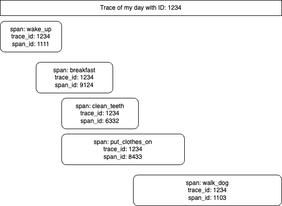

In the second of the series, the spans are enriched with useful metadata: Setting the span status, adding span attributes and span events.

This is the text version for those who prefer to read instead. If you got here and want to watch, just click the image below.

## Understanding span_id and trace_id

Each span has a name, which you defined in the decorator on line 19. Each span has a unique `span_id` and a (possibly non unique) `trace_id`. The difference between these two fields is that the `span_id` provides an ID for the small unit of work (the `add` method).

Realise though that in a realistic program, you will have multiple functions and many microservices. Ie. you will have many spans. The `trace_id`.

To put it another way, imagine using OpenTelemetry to track the tasks in your day (yes, you could do that). Each task (breakfast, cleaning teeth, shower, walking the dog...) would be a span. The commonality (trace) would be the day / date. So you know that each of these discrete activities was related and can then reconstitute them into a relationship graph like this:

## Span kind field

[Every Span has a kind](https://opentelemetry.io/docs/specs/otel/trace/api/#spankind):

- CLIENT
- SERVER
- PRODUCER
- CONSUMER
- INTERNAL (default)

The specification (linked above) describes the differences in detail, but `UNSET` (the default) means: "Indicates that the span represents an internal operation within an application..." so that is actually appropriate for our usecase.

## Parent ID, start and end time

The parent ID of our span is `null` this simply means that "this span had no parent span" (nothing came before it).

The `start_time` and `end_time` should be self explanatory. Subtracting one from the other gives us the duration of this span.

## Span Status

[Every span has a status](https://opentelemetry.io/docs/specs/otel/trace/api/#set-status) which is one of:

- Unset (default)
- Ok
- Error

Obviously, you (the developer) use the status field to denote success of failure of whatever action this span was trying to achieve.

We will set the Span status soon.

## Span Attributes

Span attributes are Key / Value pairs of additional metadata that you have control over. You can add whatever additional metadata you like.

We will add attributes to the span soon. Please also see the bottom of this post for a discussion / warning about attributes.

## Span Events

Sometimes, things happen during a span which may not rise to the level of having their own span - but you still want to "put a dot on the timeline" to inform viewers of this telemetry that "something happened here". That's what span events are used for. They denote that "something happened during this span that I'd like you to know about".

We will add a span event to the span soon.

