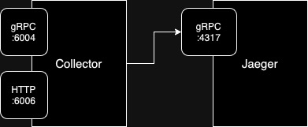
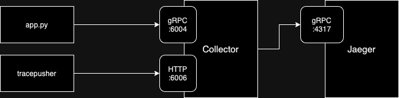
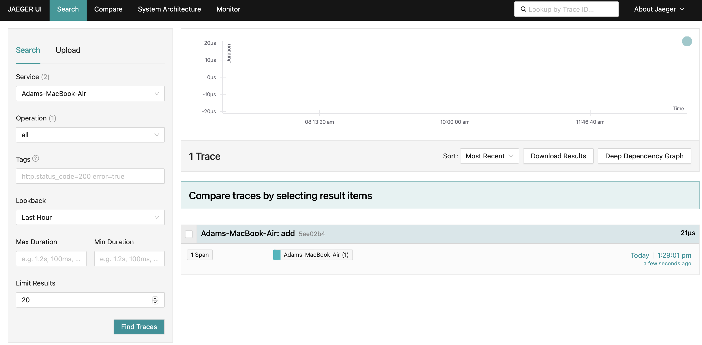

In the third episode of the series, the spans are sent from Python to Jaeger via an OpenTelemetry collector.

This is the text version for those who prefer to read instead. If you got here and want to watch, just click the image below.

[](https://www.youtube.com/watch?v=tnml6Zd58gs)

## Building the System: A Place to Send Spans

For this demo the spans will be send to the [CNCF](https://cncf.io) project [Jaeger](https://www.jaegertracing.io), but it could just as easily be any other open source or commercial backend.

Use Docker (or Podman) to start the Jaeger allInOne demo image and expose two ports:

- 18868 (for the user interface)
- 4317 (so the built in Jaeger collector can receive ports via gRPC on the standard gRPC port)

```
docker run --rm --name jaeger \
  -p 16686:16686 \
  -p 4317:4317 \
  jaegertracing/all-in-one:1.57
```

Open a browser and validate that Jaeger is visible on `http://localhost:16686`

After a few seconds, refresh the page and you'll see one service listed: `jaeger-all-in-one`. That is Jaeger tracing itself, so you can ignore that service (but its presence proves everything is working properly).

## Building the System: Add an OpenTelemetry Collector

Some backends allow you to send spans directly to them. The Jaeger allInOne image even comes bundled with it's own collector (that's why it's listening on port `4317`).

So you may choose to send spans directly to the backend. I **do not** recommend you do this. I **do** recommend you place a collector (or several) in front of your backend.

In reality you will have tens, hundreds or thousands of entities producing spans (processes, pods etc.) so placing collectors between those entities and the backend simplifies configuration and provides lots of benefits (I will explain in depth in a future video / post).

Save a file called [config.yaml](https://github.com/agardnerIT/python-opentelemetry-manual-instrumentation/blob/main/part-three/collector-config.yaml) with the following content:

```
receivers:
  otlp:
    protocols:
      grpc:
        endpoint: 0.0.0.0:6004
      http:
        endpoint: 0.0.0.0:6006

processors:

exporters:
  logging:
    verbosity: detailed

  otlp/localcollector:
    endpoint: http://localhost:4317
    tls:
      insecure: true

service:
  extensions: []
  pipelines:
    traces:
      receivers: [otlp]
      processors: []
      exporters: [otlp/localcollector, logging]
```

This configuration takes spans into the collector on either port 6004 (when they're sent via gRPC) or port 6006 (when send via HTTP), does nothing to the spans (nothing in the `processors` block) and sends them back out again to the `http://localhost:4317` endpoint (you will recognise that as the Jaeger gRPC endpoint).

I've also configured some verbose (detailed) logging output. If anything goes wrong during development, I need to quickly see what's wrong. You would probably remove this `logging` for production.
 
### Why Ports `6004` and `6006`?

I've chosen to use ports `6004` and `6006` for two reasons:

1. Jaeger is already running on port `4317` so I need to choose a different one (hence I randomly picked `6004`)
2. The demo app only sends traces via gRPC but to test the configuration (which you'll see next), I also decided to listen on `HTTP` and just chose `6006`.

## Download and Start Collector

Download the collector binary for your platform from the latest releases.

Start the collector, passing your config.yaml file as a parameter:

```
./otelcol --config=config.yaml
```

## The Architecture So Far



## Test It

It is time to ensure the system works and the "wiring" is correct. To do so, we will use a tool called [tracepusher](https://github.com/agardnerit/tracepusher). It is a utility which can emit arbitrary spans, it's useful for many "additional" usecases (like tracing CICD pipelines or shell scripts) but we will use it just to send a test span to the collector and see it in Jaeger.

tracepusher only emits spans via HTTP, hence why we needed the collector to listen on port `6006`.

[Download the tracepusher binary](https://github.com/agardnerIT/tracepusher/releases/latest) and run it:

```
./tracepusher \
  --endpoint http://localhost:6006 --insecure true \
  --span-name spanOne \
  --service-name serviceA \
  --duration 2000 \
  --duration-type ms
```

You should receive: `Response <200>` from the collector. This proves the span got to our collector.

## Check Jaeger

Refresh the Jaeger UI and two services are available. The second one matching the `--service-name` from tracepusher (ie. `serviceA`).

Select that service and click `Find Traces` and you'll see the single span.

The wiring works!

## Add Dependencies

Some new dependencies are required, so overwrite `requirements.txt` with [this file](https://github.com/agardnerIT/python-opentelemetry-manual-instrumentation/blob/main/part-three/requirements.txt):

```
opentelemetry-api == 1.24.0
opentelemetry-sdk == 1.24.0
opentelemetry-exporter-otlp-proto-grpc == 1.24.0
opentelemetry-semantic-conventions == 0.45b0
```

Use pip to install these new dependencies:

```
pip install -r requirements.txt
```

## The App: Export spans to Collector

If you have been following part one and part two of this tutorial, you will already have a file called `app.py`.

Overwrite the contents of that file with [this app.py](https://github.com/agardnerIT/python-opentelemetry-manual-instrumentation/blob/main/part-three/app.py).

99% of the content is identical but let's run the app and explore the changes.

```
python app.py
```

## The Architecture So Far

The architecture now looks like this:



## Differences in app.py

Line `15` & `16` define two new variables: `COLLECTOR_ENDPOINT` and `COLLECTOR_GRPC_PORT`.

Notice that these both point to the standalone collector.

Line `19` replaces the old `ConsoleSpanExporter` instead with an `OTLPSpanExporter` which emits spans to `http://<COLLECTOR_ENDPOINT>:<COLLECTOR_GRPC_PORT>` ie. `http://localhost:6004`.



## Summary

In this post, and the accompanying video, we have successfully send OpenTelemetry traces from a Python application, via an OpenTelemetry collector, into a span storage backend (Jaeger).

In the next installment of this series, we will re-write the application to emit a trace which contains multiple spans. So, [subscribe to my channel on Youtube](https://www.youtube.com/@agardnerit) and I'll see you then!
