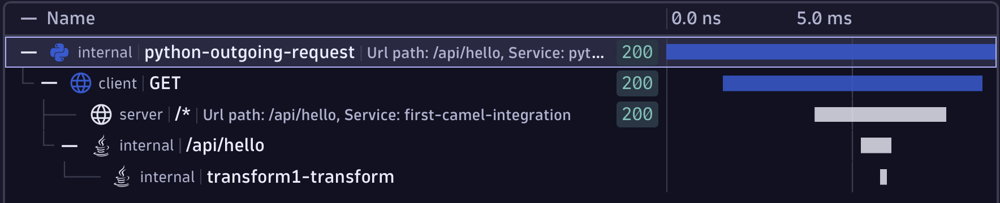
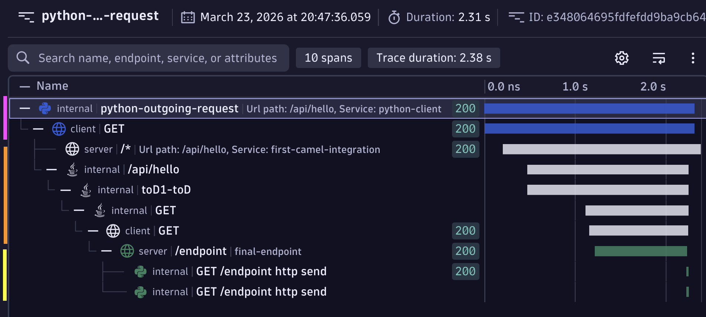

# Tracing Python, FastAPI and requests through Apache Camel 4 using OpenTelemetry

In this post I'm going to walk you through how to trace from Python through Apache Camel to another Python process. End to end using OpenTelemetry - and it's really not as hard as it sounds!

```
Python --> Apache Camel --> Python
```

<!-- more -->

## Prerequisites / My Setup

I'm using an Amazon Linux EC2 instance (`t3.micro`). I've installed Java 17 using Amazon's Corretto distribution and maven.

```
sudo yum install -y java-17-amazon-corretto-devel maven
```

`mvn --version` and `java --version` should both work.

## Download OpenTelemetry components

You'll need the OpenTelemetry collector so that data can make it from the VM to whatever backend you want to use.

```
wget https://github.com/open-telemetry/opentelemetry-collector-releases/releases/download/v0.148.0/otelcol-contrib_0.148.0_linux_amd64.tar.gz
tar -xf otelcol-contrib_0.148.0_linux_amd64.tar.gz
```

You'll also need the OpenTelemetry Java instrumentation JAR so that you can instrument Apache Camel (don't worry, it'll make sense later when we plug it all together).

```
wget https://github.com/open-telemetry/opentelemetry-java-instrumentation/releases/download/v2.26.0/opentelemetry-javaagent.jar
```

## Create Collector configuration and run collector

!!! tip "The OpenTelemetry Collector?"

    If you're new to the OpenTelemetry collector, you will probably find value in watching my video [OpenTelemetry Collector: Everything you need to know to get started](https://youtu.be/_CJrFW_yjRo)

The OpenTelemetry data from both the Python process and Apache camel needs to be sent somewhere. We will send it to an OpenTelemetry Collector instance running locally.

The collector needs a configuration file, so set that up now:

```
cat <<EOF > otel-collector-config.yaml
receivers:
  otlp:
    protocols:
      http:
        endpoint: localhost:4318
exporters:
  debug:
    verbosity: detailed

service:
  pipelines:
    logs:
      receivers: [otlp]
      exporters: [debug]
    metrics:
      receivers: [otlp]
      exporters: [debug]
    traces:
      receivers: [otlp]
      exporters: [debug]
EOF
```

This is probably the most basic collector configuration you can write. In reality you'll want all sorts of other things in this config file for anything more than this quick demo (see [my YouTube channel for lots of videos about OpenTelemetry and the collector](https://youtube.com/@agardnerit)). The collector will listen for incoming metrics, logs and traces on `localhost:4318`. The collector expects incoming data to be in the OTLP (OpenTelemetry Protocol) format and sent via `HTTP` (as opposed to `gRPC`).

Any data that is sent will simply be printed out to the collector console (debug output).

Start the collector and leave it running, waiting for incoming data.

```
./otelcol-contrib --config=otel-collector-config.yaml
```

## Create Maven project

I'm going to follow the basic [getting started guide](https://camel.apache.org/camel-core/getting-started/index.html#BookGettingStarted-CreatingYourFirstProject).

```
mvn archetype:generate -B -DarchetypeGroupId=org.apache.camel.archetypes -DarchetypeArtifactId=camel-archetype-java -DarchetypeVersion=4.18.0 -Dpackage=org.apache.camel.learn -DgroupId=org.apache.camel.learn -DartifactId=first-camel-integration -Dversion=1.0.0-SNAPSHOT
```

## Add API to Camel

Camel will be called from a Python script so Camel needs a "front door". We'll use an API for that.

Change directory into `first-camel-integration` and open `pom.xml`

In the `<dependencies>` section, add a new `dependency`:

```
<dependencies>
...
    <!-- Incoming API Endpoint -->
    <dependency>
      <groupId>org.apache.camel</groupId>
      <artifactId>camel-jetty</artifactId>
    </dependency>
...
<dependencies>
```

Open `src/main/java/org/apache/camel/learn/MyRouteBuilder.java`

Replace the `configure()` method code with the following code. It will add a REST endpoint `http://localhost:8080/api/hello` that our Python script (yet to be written) will call and return a message `Hello from Camel!`


```
public void configure() {

    // here is a sample which processes the input files
    // (leaving them in place - see the 'noop' flag)
    // then performs content based routing on the message using XPath
    from("file:src/data?noop=true")
        .choice()
            .when(xpath("/person/city = 'London'"))
                .log("UK message")
                .to("file:target/messages/uk")
            .otherwise()
                .log("Other message")
                .to("file:target/messages/others");
    
    // Add a REST endpoint so Python can call Camel
    restConfiguration()
        .component("jetty")
        .host("127.0.0.1")
        .port(8080);
    
    rest("/api")
        .get("/hello")
            .to("direct:hello");

    from("direct:hello")
        .transform().constant("Hello from Camel!");
}
```

## Step 3: Create Python caller

Time to create the Python script that will start the end-to-end flow and actually call Apache.

First, create and install the dependencies we'll need - `OpenTelemetry` and `requests`
```
cat <<EOF > requirements.txt
requests == 2.32.5
opentelemetry-sdk == 1.40.0
opentelemetry-exporter-otlp-proto-http == 1.40.0
opentelemetry-instrumentation-requests == 0.61b0
fastapi == 0.128.8
EOF
```

Now install them:
```
pip3 install -r requirements.txt
```

Create the caller script:

```
cat <<EOF > caller.py
from opentelemetry import trace
from opentelemetry.sdk.trace import TracerProvider
from opentelemetry.sdk.resources import Resource
from opentelemetry.sdk.trace.export import BatchSpanProcessor
from opentelemetry.exporter.otlp.proto.http.trace_exporter import OTLPSpanExporter
import requests
from opentelemetry.instrumentation.requests import RequestsInstrumentor

RequestsInstrumentor().instrument()

trace.set_tracer_provider(
    TracerProvider(
        resource=Resource.create({"service.name": "python-client"})
    )
)

provider = trace.get_tracer_provider()
provider.add_span_processor(BatchSpanProcessor(OTLPSpanExporter(endpoint="http://localhost:4318/v1/traces")))

tracer = trace.get_tracer(__name__)

camel_url = "http://localhost:8080/api/hello"

with tracer.start_as_current_span("python-outgoing-request") as span:
    span.set_attribute("http.method", "GET")
    span.set_attribute("http.url", camel_url)

    response = requests.get(camel_url, timeout=10)

    span.set_attribute("http.status_code", response.status_code)
    print(f"Response: {response.status_code} - {response.text[:200]}")

print("\nSpans sent to collector! Check collector output.")
EOF
```

The short explanation of the above code is that this code does a `GET` request to `http://localhost:8080/api/hello` (which is where cCmel will be listening) and that requesting code is traced using OpenTelemetry, tagged with a service name of `python-client` and this "part" of the end to end through Camel will be called `python-outgoing-request`. The OpenTelemetry data will be sent to the collector that's already listening on port `4318`.

## Add OpenTelemetry to Camel

It's time to add OpenTelemetry to Camel. Open `pom.xml` and add two additional dependencies:

```
...
<dependencies>
...
    <!-- OTEL -->
    <!-- Source: https://mvnrepository.com/artifact/org.apache/camel/camel-opentelemetry2 -->
    <dependency>
      <groupId>org.apache.camel</groupId>
      <artifactId>camel-opentelemetry2</artifactId>
      <version>4.18.0</version>
      <scope>compile</scope>
    </dependency>
    <!-- Add MDC to OTEL -->
    <dependency>
      <groupId>org.apache.camel</groupId>
      <artifactId>camel-mdc</artifactId>
    </dependency>
...
</dependencies>
...
```

You can read more [here](https://camel.apache.org/components/4.18.x/others/opentelemetry2.html) about the opentelemetry2 and the Mapped Diagnostic Context (MDC) which means you can tie logs to traces.

Next enable OpenTelemetry in Camel. To do this, create a file called `application.properties` in `src/main/resources/` (see [here](https://camel.apache.org/components/4.18.x/others/opentelemetry2.html) for an explanation of these properties):

```
cd first-camel-integration
cat <<EOF > src/main/resources/application.properties
camel.opentelemetry2.enabled = true
camel.opentelemetry2.traceProcessors = true
camel.opentelemetry2.traceHeadersInclusion = true
camel.mdc.customHeaders=CAMEL_TRACE_ID,CAMEL_SPAN_ID
EOF
```

## Build and start Camel

OK, Camel is ready to go. Build and start it. Leave it running and waiting for the incoming API call (which we'll fire in soon).

Notice the `JAVA_TOOL_OPTIONS` these force Camel to load the `opentelemetry-javaagent.jar` at startup time and provide other essential OpenTelemetry configuration options. This parameter also tells Camel where to send the data it generates (ie. to the collector running on `http://localhost:4318`).


```
export JAVA_TOOL_OPTIONS="-javaagent:opentelemetry-javaagent.jar -Dotel.service.name=first-camel-integration -Dotel.traces.exporter=otlp -Dotel.exporter.otlp.protocol=http/protobuf -Dotel.exporter.otlp.endpoint=http://localhost:4318"

mvn clean compile && mvn camel:run
```

Check the OpenTelemetry collector terminal - you should already see output because the standard Camel demo project looks in `src/data` and copies the XML files from there to `target/messages`. These Camel actions are captured using OTEL and sent to the collector.

## Quick recap

By now you should have two terminal windows open:

* 1x running the OpenTelemetry collector
* 1x running Apache Camel

## Trigger Apache Camel using Python

Run the caller script to trigger Apache Camel:

```
python3 caller.py
```

Look at the collector output, you should see LOTS of output like this:

```
ScopeSpans #0
ScopeSpans SchemaURL: https://opentelemetry.io/schemas/1.11.0
InstrumentationScope opentelemetry.instrumentation.requests 0.61b0
Span #0
    Trace ID       : 774eb348adf535725f7da81e269feeba
    Parent ID      : 69e97c50bb10a94a
    ID             : ca3b560adbf51424
    Name           : GET
    Kind           : Client
    Start time     : 2026-03-22 08:06:15.559491603 +0000 UTC
    End time       : 2026-03-22 08:06:15.566468839 +0000 UTC
    Status code    : Unset
    Status message : 
    DroppedAttributesCount: 0
    DroppedEventsCount: 0
    DroppedLinksCount: 0
Attributes:
     -> http.method: Str(GET)
     -> http.url: Str(http://localhost:8080/api/hello)
     -> user_agent.original: Str(python-requests/2.32.5)
     -> http.status_code: Int(200)
ScopeSpans #1
ScopeSpans SchemaURL: 
InstrumentationScope __main__ 
Span #0
    Trace ID       : 774eb348adf535725f7da81e269feeba
    Parent ID      : 
    ID             : 69e97c50bb10a94a
    Name           : python-outgoing-request
    Kind           : Internal
    Start time     : 2026-03-22 08:06:15.557971639 +0000 UTC
    End time       : 2026-03-22 08:06:15.566852816 +0000 UTC
    Status code    : Unset
    Status message : 
    DroppedAttributesCount: 0
    DroppedEventsCount: 0
    DroppedLinksCount: 0
Attributes:
     -> http.method: Str(GET)
     -> http.url: Str(http://localhost:8080/api/hello)
     -> http.status_code: Int(200)
```

Cutting all of that down, I see (your IDs will be different):

```
Trace ID       : 774eb348adf535725f7da81e269feeba
Parent ID      : 
ID             : 69e97c50bb10a94a
Name           : python-outgoing-request
...
Trace ID       : 774eb348adf535725f7da81e269feeba
Parent ID      : 69e97c50bb10a94a
ID             : ca3b560adbf51424
Name           : GET
...
Trace ID       : 774eb348adf535725f7da81e269feeba
Parent ID      : ca3b560adbf51424
ID             : 368bdbada8008711
Name           : GET /*
...
Trace ID       : 774eb348adf535725f7da81e269feeba
Parent ID      : ca3b560adbf51424
ID             : a47e1fb1895d2e7b
Name           : /api/hello
...
Trace ID       : 774eb348adf535725f7da81e269feeba
Parent ID      : a47e1fb1895d2e7b
ID             : 551aca89905cb2bd
Name           : transform1-transform
...
```

## What in the world is this!?

These snippets are the individual "pieces" or "units of work" as the request works its way from Python across to Camel and through Camel. These are called [spans](https://opentelemetry.io/docs/concepts/signals/traces/#spans) and together they make up a trace (see my video [spans vs. traces](https://www.youtube.com/watch?v=KPGjqus5qFo))

Now if you have endless patience, you can actually reconstruct that:

* Every span has the same trace ID, so I know these are all related as a single end to end flow.
* The first span (ID `69e9...`) has no "parent ID" so I know this is the first thing that happened (in OpenTelemetry terms, this is the root span)
* The second span (ID: `ca3b...`) has a parent span ID `69e9...` so I know this second span is a "child" of the first span.
* The third span (ID: `368b...`) also has a parent span ID `ca3b...` so this span is nested another level down as a child of the second span.

and so on...

> But who has time for any of that?

This is what it looks like visually when I send it to an observability backend.



## Add outbound call from Camel

It's time for the last hop. The call **out** of Apache Camel and into another Python process.

Add a new dependency inside the `<dependencies>` block to `pom.xml` which allows outbound HTTP calls to be made:

```
<!-- Outbound calls to vm2 -->
<dependency>
  <groupId>org.apache.camel</groupId>
    <artifactId>camel-http</artifactId>
</dependency>
```

Now add the code to actually make that call. Open `src/main/java/org/apache/camel/learn/MyRouteBuilder.java` and add this snippet into the `configure()` method:

```
from("direct:hello")
.toD("http://localhost:9090/endpoint?bridgeEndpoint=true");
```

When the API calls into Camel (via the `/api/hello` endpoint), this code will be invoked and an outgoing request will be made to `localhost:9090/endpoint` (you'll write this code next).

## Create Python API to listen for outbound Camel call

Above we've configured Apache Camel to send a request to `localhost:9090/endpoint` but of course, there's nothing listening there yet.

Create an API which uses Uvicorn and FastAPI and is fully traced with OpenTelemetry. The telemetry will be sent to the existing collector on localhost:

First add the new dependencies to `requirements.txt` and install them:

```
cd first-camel-integration
cat <<EOF >> requirements.txt
uvicorn == 0.39.0
fastapi == 0.128.8
EOF
pip install -r requirements.txt
```

```
cat <<EOF > app2.py
import time
import uvicorn
from fastapi import FastAPI
from opentelemetry import trace
from opentelemetry.sdk.trace import TracerProvider
from opentelemetry.sdk.resources import Resource
from opentelemetry.sdk.trace.export import BatchSpanProcessor
from opentelemetry.exporter.otlp.proto.http.trace_exporter import OTLPSpanExporter
from opentelemetry.instrumentation.fastapi import FastAPIInstrumentor

trace.set_tracer_provider(
    TracerProvider(
        resource=Resource.create({"service.name": "final-endpoint"})
    )
)

provider = trace.get_tracer_provider()
provider.add_span_processor(BatchSpanProcessor(OTLPSpanExporter(endpoint="http://localhost:4318/v1/traces")))

tracer = trace.get_tracer(__name__)

app = FastAPI()

# Instrument FastAPI with OpenTelemetry
FastAPIInstrumentor.instrument_app(app)

@app.get("/endpoint")
def endpoint():

    time.sleep(1)

    return {"message": "Hello from the endpoint that is called by Camel"}

if __name__ == "__main__":
    uvicorn.run(app, host="0.0.0.0", port=9090)
EOF
```

## Start the stack and fire off a request

It's time to start the processes!

1. Make sure the OpenTelemetry Collector is running:

```
./otelcol-contrib --config=otel-collector-config.yaml
```

2. Restart Apache Camel

```
export JAVA_TOOL_OPTIONS="-javaagent:opentelemetry-javaagent.jar -Dotel.service.name=first-camel-integration -Dotel.traces.exporter=otlp -Dotel.exporter.otlp.protocol=http/protobuf -Dotel.exporter.otlp.endpoint=http://localhost:4318"

mvn clean compile && mvn camel:run
```

3. Start the Python FastAPI server so Camel can send it a request

```
python3 app2.py
```

You should see:

```
INFO:     Started server process [120723]
INFO:     Waiting for application startup.
INFO:     Application startup complete.
INFO:     Uvicorn running on http://0.0.0.0:9090 (Press CTRL+C to quit)
```

3. Run the caller.py file again which sends a request to Camel

```
python3 caller.py
```

You'll see lots of spans hit the collector, tracing from the first Python caller, through Apache Camel and into the last Python endpoint.

If you send the spans to an observability backend, this is what it should look like. The magenta bars (spans) are the initial Python caller, the orange chunk is Apache Camel and the yellow is the last FastAPI microservice in the chain that Camel calls.

