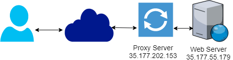

I was recently asked to configure a reverse proxy server. It was a stepping stone to a further goal but I hadn’t actually configured one before.

Whenever I haven’t attempted something before, I always try and keep a record of what I try so that I know what works & crucially what doesn’t.

So here’s my config, dear reader. I hope it helps you!

<!-- more -->

## What We're Building



This simple demo will have one proxy server and one web server. The user will interact with the proxy server and as far as they’re concerned, the requests are returned by the proxy server. The end user never has to know that there’s a different server “behind the scenes”.

I’m building this in AWS but any cloud provider (or VMs) will work.

## Configuration

Create two plain EC2 (or other compute nodes) instances. `t2.micro’s` are fine for this.

### Step 1: Setup The Webserver

Execute the following on the webserver box.

```bash
sudo yum update -y
sudo yum install httpd -y
echo "this is the web server" | sudo tee /var/www/html/index.html > /dev/null
sudo service httpd start
```

Visit the web server URL in a browser. You should see the text `this is the web server`. This is the first and last time you’ll access the webserver directly.

## Step 2 Setup The Proxy Server

Execute the following on the proxy server box.

```bash
sudo yum update -y
sudo yum install httpd -y
printf "this is the proxy server" | sudo tee /var/www/html/index.html > /dev/null
sudo service httpd start
```

Visit the proxy server URL in a browser. You should see the text `this is the proxy server`. This is only a sanity check to ensure the proxy is up and running. We have one more configuration to adjust now. At this point, it is not working as you want (the web server should be invisible to the end user).

Let’s configure the proxy to actually do what we want. To do that, we need to add two lines to the end of `/etc/httpd/conf/httpd.conf`

```
ProxyPass / http://WEBSERVERIP
ProxyPassReverse / http://WEBSERVERIP
```

For my IPs, I can run the following command.

```bash
printf "ProxyPass / http://35.177.55.179\nProxyPassReverse / http://35.177.55.179" | sudo tee -a /etc/httpd/conf/httpd.conf > /dev/null
```

Now reload the httpd process to pick up these changes

```bash
sudo service httpd reload
```

Refresh the proxy server page and you should now see the text `this is the web server`.

## What's Going On?

All the magic is due to those two lines `ProxyPass` and `ProxyPassReverse`.
`ProxyPass /` is an instruction that this Apache should pass all requests (denoted by /) to that URL (`http://WEBSERVERIP`)

`ProxyPassReverse` instructs apache to overwrite the Location, Content-Location and URI headers on HTTP redirect responses. This is essential to avoid bypassing the reverse proxy when the backend servers may be issuing redirects.
