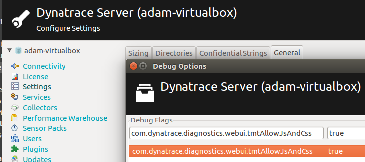
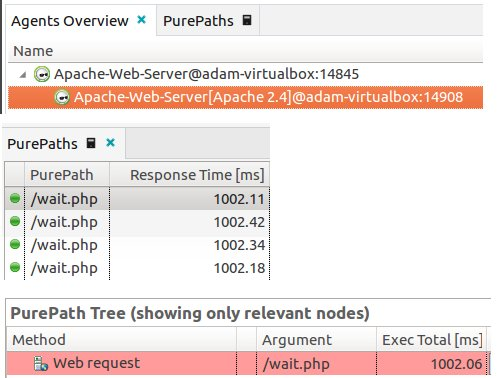
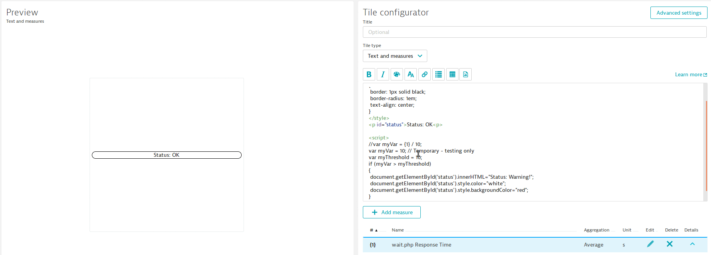

One of the coolest features of AppMon 7.0 is the ability to add custom JS and CSS to your dashboards. Let’s see what’s possible…

<!-- more -->

---

Update: 04/03/2018
The capabilities described in the following post are available in Dynatrace AppMon v7.0.0 – v7.0.9. After v7.0.9 the javascript and CSS functionality was removed for security reasons.

v7.0.9 and onwards include the ability to define variables and perform mathematical operations on variables as an out-of-the-box piece of functionality – no debug flags or workarounds required.

---

Dynatrace application monitoring (AppMon) 7.0 introduced the ability to include custom Javascript and CSS in your web dashboards. This makes for some pretty powerful visualisation and dashboarding abilities.

## Prerequisites

To follow this tutorial you’ll need:

- A working and licensed AppMon server and collector.
- An instrumented Apache server with my [wait.php file](https://github.com/agardnerIT/XAMPP-Pages/blob/master/wait.php).
- Put the client into debug mode (`Ctrl + F9`) then set the `com.dynatrace.diagnostics.webui.tmtAllowJsAndCss` debug flag to `true` (server settings > general tab > debug options).



## Intelligent Dashboards

AppMon 7 allows markdown and measure substitution within that markdown (meaning {1} will be replaced with a response time, for example) but wouldn’t it be great if we could take that a step further and actually do maths in the dashboards themselves?

Let’s get the basics set up first. Verify that your Apache server is instrumented correctly, then fire some requests at the wait.php page to generate some purepaths.



Create a response time measure on the wait.php page.


Open the web dashboards (https://DT-SERVER:9911), create a new dashboard and chart the measure. You should have something resembling this:


## Text & Measurement Dashlet

Let’s use another new feature of AppMon 7 – the text replacement feature.

Add a new text and measures tile to your dashboard and add the `wait.php` measure twice (one aggregation set to average and one set to maximum). The {1} and {2} will be dynamically replaced with the average and maximum response times respectively.

```
Average response time of Wait Page: {1}
Maximum response time of Wait page: {2}
```


CUSTOM JAVASCRIPT

Taking things a step further, we can even use these replacements in custom javascript code.

The following code takes the average response time, divides it by 10 the stores it into a JS variable called `myVar`. I can then use this as standard JavaScript code, so if `myVar` is above `myThreshold`, I visually warn the user with new message and a red background:

```
<style>
#status
{
  border: 1px solid black;
  text-align: center;
}
</style>
<p id="status">Status: OK</p>

<script>
var myVar = {1} / 10;
var myThreshold = 10;

if (myVar > myThreshold)
{
  document.getElementById(‘status’).innerHTML="Status: Warning!";
  document.getElementById(‘status’).style.color="white";
  document.getElementById(‘status’).style.backgroundColor="red";
}
</script>
```

(click video for full resolution version)


## Bonus: CSS Animations

How about combining all of this into a nice, slick CSS animated warning message?

```
<style>
#status
{
  border: 1px solid black;
  text-align: center;
}
</style>
<p id="status">Status: OK</p>

<script>
var myThreshold = 10;
if (myVar > myThreshold)
{
  document.getElementById("status").innerHTML = "Status: Warning!";
  document.getElementById("status").style.animationName = "warningAnimation";
  document.getElementById("status").style.animationDuration = "2s";
  document.getElementById("status").style.animationIterationCount = "infinite";
}
</script>
<style>
/* Safari 4.0 – 8.0 */
@-webkit-keyframes warningAnimation {
  to {background-color: red; color: white;}
}

/* Standard syntax */
@keyframes warningAnimation {
  to {background-color: red; color: white;}
}
</style>
```

(click video for full resolution version)


Has this sparked your curiosity or creativity? [Drop me a line](../contact.md) and let me know what you’re thinking of building!
