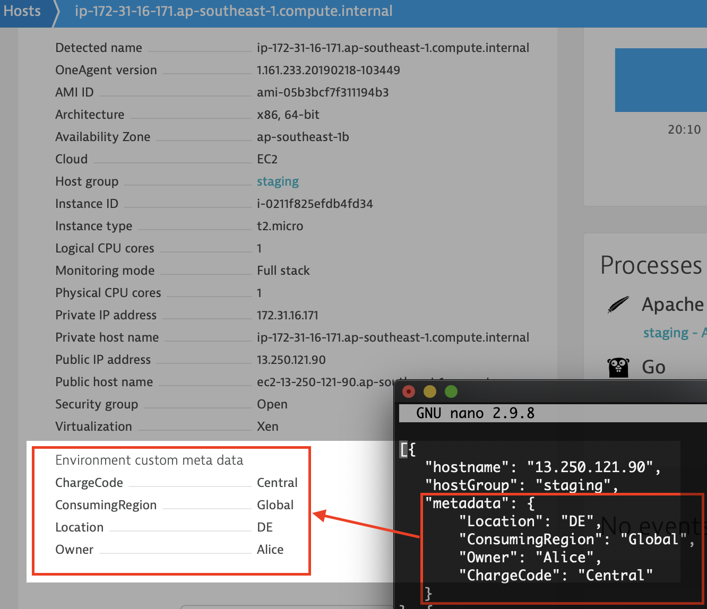

Part two of my Dynatrace Autonomous Monitoring series demonstrates how to specify your host metadata as code & automate any updates.

<!-- more -->

The series is intended to build upon the previous lessons, so I highly suggest you complete part one ([automated host groups](assured-host-groups-autonomous-monitoring.md)) first.



## Include Metadata in JSON

As a reminder, we ended the [previous tutorial](assured-host-groups-autonomous-monitoring.md) with a JSON file which looked like this:

```json
[{
  "hostname": "host1",
  "hostGroup": "something"
}, {
   "hostname": "IP-ADDRESS",
   "hostGroup": "FirstGroup"
}, {
   "hostname": "IP-ADDRESS",
   "hostGroup": "SecondGroup"
}]
```

Now let’s add our metadata variables to the JSON file. You can add as many as you like (or none). Metadata values are simple Key / Value pairs which represent whatever useful data you wish to provide.

```json
[{
   "hostname": "10.0.0.1",
   "hostGroup": "staging",
   "metadata": {
       "Location": "DE",
       "ConsumingRegion": "Global",
       "Owner": "Alice",
       "ChargeCode": "Central"
   }
}, {
   "hostname": "10.0.0.2",
   "hostGroup": "production",
   "metadata": {
       "Location": "FR",
       "ConsumingRegion": "EU",
       "Owner": "Bob",
       "ChargeCode": "GLOBAL123"
   }
}, {
   "hostname": "10.0.0.3",
   "hostGroup": "production",
   "metadata": {}
}]
```

## Read & Push Metadata

Finally, we need to add a few new tasks to the playbook. These tasks will:

- Use the built-in ansible `set_facts` capability to store the metadata within Ansible.
- Remove the `hostcustomproperties.conf` file if it exists. This ensures any changes to the JSON are pushed immediately on the next execution of the playbook.
- Create a new `hostcustomproperties.conf` file and write the metadata as `Key=Value` pairs.
- Modify the playlist from the previous tutorial and add 2 new tasks to the end:

```yaml
- name: "Set Facts"
  set_fact:
   "metadata" : "{{ item.metadata }}"
  loop: "{{ hostList }}"
  when: item.hostname == inventory_hostname

- name: "Remove File if it Exists"
  become: yes
  file:
    path: /var/lib/dynatrace/oneagent/agent/config/hostcustomproperties.conf
    state: absent

- name: "Write KVs to File"
  become: yes
  lineinfile:
    path: /var/lib/dynatrace/oneagent/agent/config/hostcustomproperties.conf
    line: "{{ item.key }}={{ item.value }}"
    create: yes
  with_dict: "{{ hostvars[inventory_hostname]['metadata'] }}"
```

Your playbook should look like this:


```
---
- name: Consistent Host Groups and Metadata
  hosts: apache

  vars:
    hostList: "{{ lookup('file', 'hostList.json') }}"
    oneagent_installer_script_url: "https://***.live.dynatrace.com/api/v1/deployment/installer/agent/unix/default/latest?Api-Token=***&arch=x86&flavor=default"
    defaultHostGroup: "DefaultGroup"

  tasks:
  - name: Check if Dynatrace OneAgent is already installed
    stat:
      path: /opt/dynatrace/oneagent/agent/lib64/liboneagentos.so
    register: agent_installed

  - name: Set Host Group Facts
    set_fact:
      hostGroup: "{{ item.hostGroup }}"
    loop: "{{ hostList }}"
    when: item.hostname == inventory_hostname

  - name: Download OneAgent
    get_url:
      url: "{{ oneagent_installer_script_url }}"
      dest: "/tmp/dynatrace-oneagent.sh"
    when: agent_installed.stat.exists == False

  - name: Install Agent
    shell: "sh /tmp/dynatrace-oneagent.sh --set-app-log-content-access=true --set-infra-only=false --set-host-group={{ hostvars[inventory_hostname].hostGroup | default(defaultHostGroup)  }}"
    become: yes
    when: agent_installed.stat.exists == False

  - name: Get Current Host Group
    shell: "/opt/dynatrace/oneagent/agent/tools/lib64/oneagentutil --get-host-group"
    become: yes
    when: agent_installed.stat.exists == True
    register: currentHostGroup

  - name: Update Host Group
    shell: "/opt/dynatrace/oneagent/agent/tools/lib64/oneagentutil --set-host-group={{ hostvars[inventory_hostname].hostGroup | default(defaultHostGroup) }} --restart-service"
    become: yes
    when: agent_installed.stat.exists == True and currentHostGroup.stdout != (hostvars[inventory_hostname].hostGroup | default(defaultHostGroup))

  - name: "Set Facts"
    set_fact:
      "metadata" : "{{ item.metadata }}"
    loop: "{{ hostList }}"
    when: item.hostname == inventory_hostname

  - name: "Remove File if it Exists"
    become: yes
    file:
      path: /var/lib/dynatrace/oneagent/agent/config/hostcustomproperties.conf
      state: absent

  - name: "Write KVs to File"
    become: yes
    lineinfile:
      path: /var/lib/dynatrace/oneagent/agent/config/hostcustomproperties.conf
      line: "{{ item.key }}={{ item.value }}"
      create: yes
    with_dict: "{{ hostvars[inventory_hostname]['metadata'] }}"
```

Here’s a correctly formatted copy of the [playbook](https://github.com/agardnerIT/OddFiles/blob/master/consistentHostGroupAndMetadata.playbook.yml) and [JSON](https://github.com/agardnerIT/OddFiles/blob/master/consistentHostListMetadata.json) on Github.

