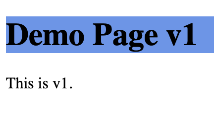
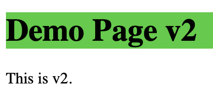

---

title: Canary Releases in Istio & Kubernetes
header_image: /images/headerimages/canary-header.jpg
categories:
- canary
- istio
- kubernetes
date:
  created: 2020-01-10
---

Recently I have been playing with [Istio](https://istio.io) on Kubernetes & one of the things I wanted to achieve was seamless canary releases. Turns out it is **really easy** with Istio. Let's dive in...

<!-- more -->

## Prerequisites
To follow along, you will need:
- A kubernetes cluster (localhost Docker for Desktop is fine).
- Istio installed (Installation takes 5 mins - see [getting started guide](https://istio.io/docs/setup/getting-started)).
- Your `default` namespace labelled with `istio-injection=enabled`.

## Overview
We will deploy two versions of a website to our k8s cluster as two seperate Services: `v1` and `v2`.

We will then use Istio to control the traffic routing between the two versions of our service.

We start at 100% of traffic on `v1` and gradually switch over to `v2`.

This is `v1`.


This is `v2`.


## Deployments
Save and apply the `v1` deployment YAML file:

**web-v1-deployment.yaml**
```
apiVersion: apps/v1
kind: Deployment
metadata:
  name: web-v1
  labels:
    app: web
    version: v1
spec:
  replicas: 1
  selector:
    matchLabels:
      app: web
      version: v1
  template:
    metadata:
      labels:
        app: web
        version: v1
    spec:
      containers:
      - image: gardnera/canarytester:v1
        name: web-v1
        ports:
        - containerPort: 80
        imagePullPolicy: Always
      restartPolicy: Always
```

Then apply with:

```
kubectl apply -f web-v1-deployment.yaml
```

Repeat for `v2`:

**web-v2-deployment.yaml**
```
apiVersion: apps/v1
kind: Deployment
metadata:
  name: web-v2
  labels:
    app: web
    version: v2
spec:
  replicas: 1
  selector:
    matchLabels:
      app: web
      version: v2
  template:
    metadata:
      labels:
        app: web
        version: v2
    spec:
      containers:
      - image: gardnera/canarytester:v2
        name: web-v2
        ports:
        - containerPort: 80
        imagePullPolicy: Always
      restartPolicy: Always
```

Apply with:

```
kubectl apply -f web-v2-deployment.yaml
```

Verify that both pods are running and they both show `2/2` under "READY":

```
kubectl get pods
NAME             READY   STATUS    RESTARTS   AGE
web-v1-***-***   2/2     Running   0          1m
web-v2-***-***   2/2     Running   0          1m
```

## Services
The pods are running and Istio has been injected (proven by the `2/2` shown above).

Now we will create a service for each version. Save and apply these YAML files:

**web-v1-service.yaml**

```
apiVersion: v1
kind: Service
metadata:
  name: web-v1-service
spec:
  ports:
  - name: "80"
    port: 80
  selector:
    app: web
    version: v1
```
**web-v2-service.yaml**

```
apiVersion: v1
kind: Service
metadata:
  name: web-v2-service
spec:
  ports:
  - name: "80"
    port: 80
  selector:
    app: web
    version: v2
```

Apply both with:

```
kubectl apply -f web-v1-service.yaml
kubectl apply -f web-v2-service.yaml
```

Verify the services have been created:
```
% kubectl get services
NAME             TYPE        CLUSTER-IP  EXTERNAL-IP   PORT(S)   AGE
kubernetes       ClusterIP   10.*.*.*    <none>        443/TCP   2d19h
web-v1-service   ClusterIP   10.*.*.*    <none>        80/TCP    11s
web-v2-service   ClusterIP   10.*.*.*    <none>        80/TCP    4s
```

## Expose App Outside Cluster
The application runs on port 80 so you would think that going to `http://127.0.0.1` in a browser would show something.

Istio has actually already given us a way into the cluster on `localhost` on (among others) port `80`:

```
% kubectl get services -n istio-system
NAME              ...    EXTERNAL-IP   PORT(S) ...
istio-ingressgateway     localhost     80:32481/TCP,443:31558/TCP
```

### What's Missing?
The workload is up, running, connected to a service. We have traffic allowed to enter the cluster. What is missing?

In a nutshell, the internal routing which tells Istio: This traffic should be sent to service X, Y or Z.

## Istio Gateway and VirtualService
To resolve this, we need two more components, a `Gateway` and a `VirtualService`.

These two components work in tandem to get your traffic from the "front door" of the cluster back to the correct service.

Save this file & then I will explain:

**web-gateway-virtualservice.yaml**

```
apiVersion: networking.istio.io/v1alpha3
kind: Gateway
metadata:
  name: web-gateway
spec:
  selector:
    istio: ingressgateway # use Istio default gateway implementation
  servers:
  - port:
      number: 80
      name: http
      protocol: HTTP
    hosts:
    - "*"
---
apiVersion: networking.istio.io/v1alpha3
kind: VirtualService
metadata:
  name: web-virtualservice
spec:
  hosts:
  - "*"
  gateways:
  - web-gateway
  http:
  - match:
    - uri:
        exact: /
    route:
    - destination:
        host: web-v1-service
        port:
          number: 80
```

Reading the YAML from top to bottom:
- We create a `Gateway` called `web-gateway`.
- This gateway accepts traffic from the `istio-ingressgateway`.
- This gateway accepts `HTTP` traffic from any host (`hosts: "*"`) on port `80`.
- We create a `VirtualService` called `web-virtualservice`.
- This `VirtualService` also accepts incoming traffic from any hosts.
- This `VirtualService` is linked to the `web-gateway` ie. handles traffic from `web-gateway`.
- For all requests, the `VirtualService` does a lookup. If the URI path is exactly `/` (ie. the homepage) then traffic is routed to the `web-v1-service` Service on port `80`.

Apply this file to your cluster:

```
kubectl apply -f web-gateway-virtualservice.yaml
```

Now try to hit your website in a browser on `http://127.0.0.1`. You should see `v1`.


## Canary Releases: Introducing v2


The origin of the term "canary release" refers to the canaries that miners carried into the coalmines. These birds would be the early warning sign of dangerous gases for miners. The birds would become ill (or dead) and thus give the miners a chance to get out before they succumbed. This was still happening within my lifetime!

In the same way, we can release software to a small portion of our users which, if problems occur, gives us time to rollback safely without affecting all users.

Remember that both `v1` and `v2` are actually deployed to the cluster, but due to the `VirtualService` rule, no-one can access `v2`.

We will gradually introduce traffic to `v2` of the service until we're using `v2` exclusively.

Modify the **web-gateway-virtualservice.yaml** as such:

```
apiVersion: networking.istio.io/v1alpha3
kind: Gateway
metadata:
  name: web-gateway
spec:
  selector:
    istio: ingressgateway # use Istio default gateway implementation
  servers:
  - port:
      number: 80
      name: http
      protocol: HTTP
    hosts:
    - "*"
---
apiVersion: networking.istio.io/v1alpha3
kind: VirtualService
metadata:
  name: web-virtualservice
spec:
  hosts:
  - "*"
  gateways:
  - web-gateway
  http:
  - match:
    - uri:
        exact: /
    route:
    - destination:
        host: web-v1-service
        port:
          number: 80
      weight: 90
    - destination:
        host: web-v2-service
        port:
          number: 80
      weight: 10
```

Apply this new configuration:

```
kubectl apply -f web-gateway-virtualservice.yaml
```

You'll see the the `Gateway` remains unchanged, but the `VirtualService` configuration has been updated:

```
% kubectl apply -f web-gateway-virtualservice.yaml
gateway.networking.istio.io/web-gateway unchanged
virtualservice.networking.istio.io/web-virtualservice configured
```

Notice the new `- destination` section and the `weight` values.

As you may have guessed, we are sending 90% traffic to `v1` and 10% to `v2`.

Keep refreshing your page and you'll eventually see `v2`:


## Adjust Weights
Alter the weights and ultimately try setting `v1` weight to `0` and `v2` weight to `100`. At that point, you've fully migrated to version 2 of your application.

## Conclusion
This is powerful stuff. Link this into a delivery pipeline, automation workflow & throw in decent monitoring and you have a formidable capability.

Imagine gradually adjusting the weighting, monitoring the results (failure rate & response time being just two metrics), then automatically increasing the weighting or automating the rollback to a previous version.
