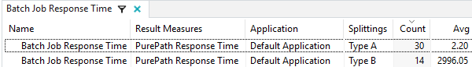
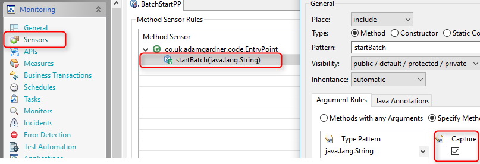
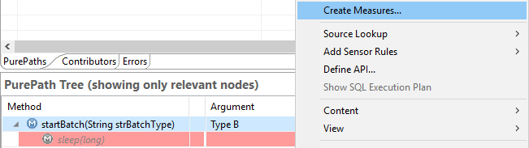
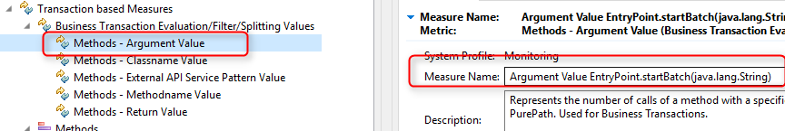
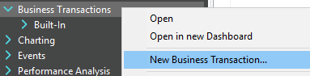
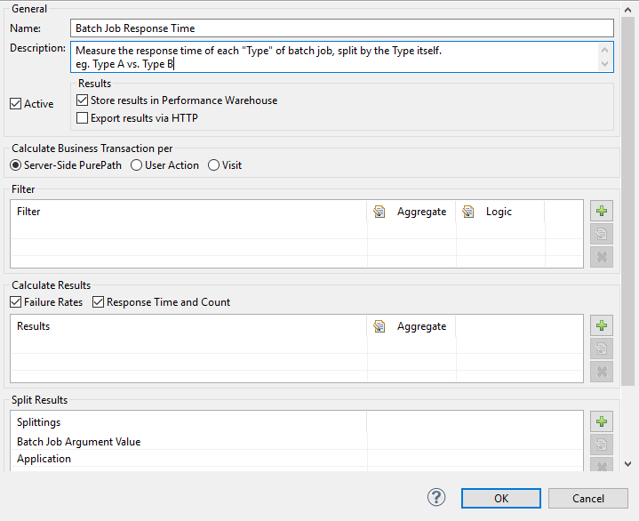

---

title: 'Dynatrace Basics: Business Transactions'
header_image: /images/headerimages/basics-business-transactions-header.png
categories:
- business transactions
- dynatrace
- appmon
date:
  created: 2017-04-05
---

--8<-- "docs/snippets/warning-legacy-dynatrace.md"

As a follow up to the previous [Creating Measures](dynatrace-basics-creating-measures.md) tutorial, let’s introduce another key Dynatrace Application Monitoring (AppMon) concept: Business Transactions.

<!-- more -->

In the last tutorial, we saw how to create basic datapoints for long term trending purposes. These are perfect as they’re extremely low overhead in terms of the processing and storage requirements on the AppMon system. However, they do have limitations.

> A Business Transaction is a way to combine multiple measures to form more complex conditions.

## Measures vs. Business Transactions

| Measures                  | Business Transactions (BTs) |
|:-------------------------:|:---------------------------:|
| Simple                    | More Complex                |
| Low Overhead	            | Higher Overhead             |
| Purepath Data: Not Linked	| Purepath Data: Linked       |
| Handles Simple Logic      | Handles Complex Logic.      |

> Measures are great for simple business requirements such as response time or SLA tracking. Business Transactions are the best fit for more complex business-logic modelling.

Let’s make the above statement a bit more concrete. Here are some scenarios and an indication of which measurement concept I’d use.

- Response time of the Contact Page – **Measure**
- Response time of the “Click on Login” button – **Measure**
- 404 Count for the About Us page – **Measure**
- Count exception for net.agardner.ConnectionException – **Measure**
- Response time of contact page when browser is Chrome and the user’s country is France – **Business Transaction**
- Response time of a batch job. Report the response times separately per batch job type – **Business Transaction**
- Response time of category pages in an eCommerce store, reported separately per category (eg. `/category/bags` vs. `/category/shoes`) – **Business Transaction**

> If you ever need to ultimately drill down to the method level data (Purepath data), you must use a business transaction.

## Business Requirements

So, let’s satisfy the two outstanding requirements from the [previous tutorial](dynatrace-basics-creating-measures.md).

1. Track the response time of the batch job when the batch type is Type B.
2. Track the response time of the batch job per execution type (ie. response time of Type A vs. Type B).

## The Solution

We can actually tackle both of these requirements with a single solution: Satisfy #2 and ignoring Type A results when those results are not needed.

## Implementing Solution – Capturing Batch Job Type

Following on from the [previous tutorial](dynatrace-basics-creating-measures.md), start your instrumented JAR file. You should already have the `startBatch` sensor placed and be seeing purepaths.

Edit the system profile > Sensors > BatchStartPP

Double click the startBatch method and enable the method capture tickbox. Kill the JAR file and restart it. This will tell AppMon to grab the actual string value as the code is executing.

Finally, let’s create a measure which will capture the String value and push the data into the Performance Warehouse. We’ll need this later – don’t worry, it’ll become clear!

Open the purepaths view, right click the top node (line) in Purepath Tree and select Create Measure

Choose the Methods – Argument Value method type and give it a good, memorable name (overwrite the default shown here).

## Building The Business Transaction

Time to build the business transaction which will result in the statistics split by the batch type:

Right click the Business Transactions cockpit item and choose New Business Transaction

I’ll explain what each of these settings mean in a future post. For now, add the measure you’ve just created to the Splitting section.

Now refresh the client (circular arrow at the top of the screen) and you’ll see your business transaction appear in the cockpit (left hand panel). Double click the BT and you’ll see something similar to this:

Congratulations! You’ve done it. You can now use these results in charts and in a future post, I’ll explain how to enable alerting based on the separate Batch job types (nobody likes false positives, do they?)
