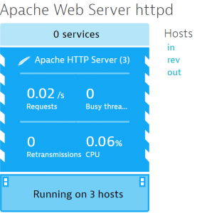
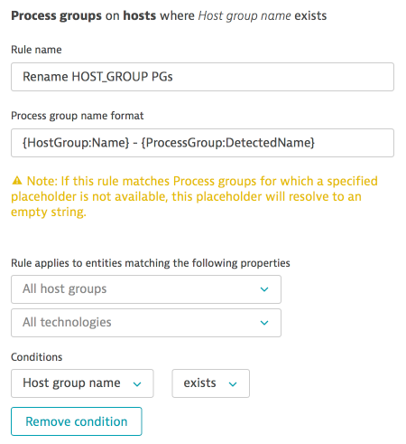

Host groups are a powerful concept in Dynatrace. This tutorial shows how to utilise host groupings to properly define and baseline a set of Apache services.  

<!-- more -->

# Architecture / Deployment Reference

First, let’s describe the basic architecture of what we’re deploying. Assume we have a set of hosts all running Apache HTTPD processes. These hosts serve 3 distinct functions within our estate:

- One set of hosts is a set of inbound proxies.
- Another is a set of outbound proxies.
- The final group of hosts are reverse proxies.

Logically, we need to separate these hosts by their function – we don’t want Dynatrace to group them all together. More crucially, we want Dynatrace to baseline and alert on them seperately.

The [official documentation](https://www.dynatrace.com/support/help/infrastructure/hosts/how-do-i-organize-my-environment-using-host-groups/) is great, so I’m not going to repeat things, aside from a few keys points:

Host groups are defined when the OneAgent is installed.
Hosts can only be a member of a single host group.
Host groups form the boundary for process groups and services.

## Why Are Host Groups Necessary?
Host groups are optional but should be considered necessary for an optimal deployment. **Utilising host groups should be considered a best practice.**

Due to the way Dynatrace creates process groups. By default, Dynatrace will see that the hosts are all running Apache HTTPD servers and thus logically group them into a single process group.



We can use the 3rd fact above to split these hosts into different process groups, based on their host group.

## Setup
Spin up 3x VMs and install the latest Apache `httpd` on them:

```bash
sudo yum install httpd24 php72 -y
```

**Do not start the Apache process yet!**

> I’m assuming you have a Dynatrace environment. If not, get a [free 15 day trial here](https://www.dynatrace.com/trial/).

## Inbound Proxy Server
Install the Dynatrace OneAgent but be sure to append the `--set-host-group=inbound-proxy` to your shell script installation.

```bash
sudo /bin/sh Dynatrace-OneAgent...sh APP_LOG_CONTENT_ACCESS=1 --set-host-group=inbound-proxy
```

## Outbound Proxy Server
Repeat for your outbound proxy server, appending `--set-host-group=outbound-proxy`

```bash
sudo /bin/sh Dynatrace-OneAgent...sh APP_LOG_CONTENT_ACCESS=1 --set-host-group=outbound-proxy
```

## Reverse Proxy Server

Finally for your reverse proxy server, appending `--set-host-group=reverse-proxy`

```bash
sudo /bin/sh Dynatrace-OneAgent...sh APP_LOG_CONTENT_ACCESS=1 --set-host-group=reverse-proxy
```

## Process Group & Host Group
Due to the host groups, once the Apache processes are started, you will have 3 distinct groups. However they’ll all be called the same default name.

Make things easy for yourself and append the host group name to the process group. You’ll be able to instantly tell which set of processes is having issues.

Do this via a process group naming rule:



## Start Your Processes
Start your apache processes on each box. You’ll see that you have 3 distinct process groups:

- inbound-proxy - Apache Web Server httpd
- outbound-proxy - Apache Web Server httpd
- reverse-proxy - Apache Web Server httpd


## Conclusion
As already mentioned, host groups are extremely powerful and this use case is just one example. Stay tuned for more use cases...
