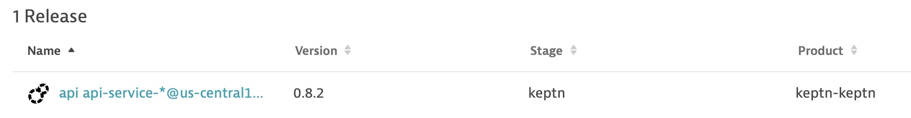
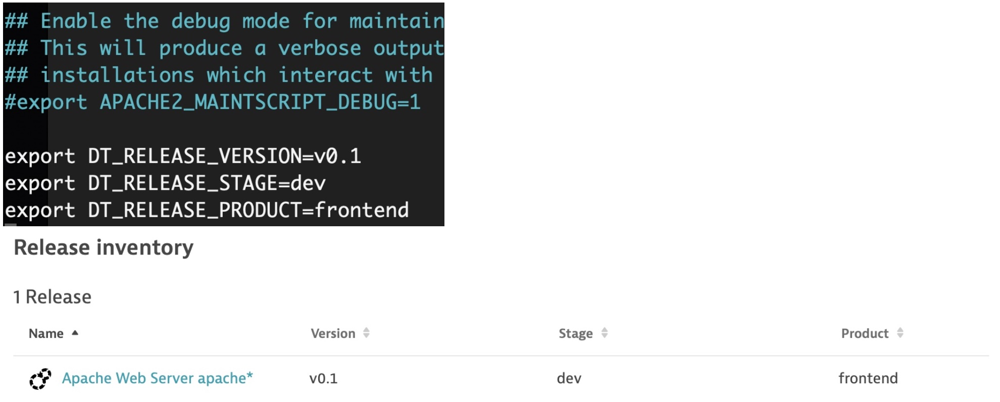

---

title: Using Dynatrace Releases
header_image: /images/headerimages/dt_release_tracking_apache.jpg
categories:
- dynatrace
- release management
date:
  created: 2021-06-05
---

This post will cover how to use the Dynatrace releases functionality...

<!-- more -->

## Assumptions
- You have a Dynatrace environment available
- You have a host (or Kubernetes cluster) with a OneAgent already installed

## Dynatrace Release Tracking
Using the Dynatrace release functionality is extremely easy. The method differs slightly whether you're using a VM based deployment for your application or Kubernetes.

Fundamentally though, there are three things you must set:

1. The product eg. `frontend`
1. The stage eg. `dev`
1. The version eg. `v0.0.1`

## Kubernetes Method

For Kubernetes, simply add Kubernetes labels to your pods:

```
app.kubernetes.io/part-of
app.kubernetes.io/version
```

The `product` value is taken from the `app.kubernetes.io/part-of` label. The `version` is taken from the `app.kubernetes.io/version` label and the `stage` is taken from either the `namespace` or the Dynatrace `host group` (if set).

That's all there is to it & you'll see releases begin to appear when new deployments are pushed.



## VM Method

Assuming you have a process on a VM, make the following environment variables available to the process during startup.

```bash
export DT_RELEASE_PRODUCT=<PRODUCT-NAME>
export DT_RELEASE_STAGE=<STAGE-NAME>
export DT_RELEASE_VERSION=<VERSION-NUMBER>

```

For example, to track `apache httpd` releases we add these variables to `/etc/apache2/envvars` and restart `apache2`:

```bash
echo 'export DT_RELEASE_VERSION=v0.1' | sudo tee -a /etc/apache2/envvars
echo 'export DT_RELEASE_STAGE=dev' | sudo tee -a /etc/apache2/envvars
echo 'export DT_RELEASE_PRODUCT=frontend' | sudo tee -a /etc/apache2/envvars
sudo service apache2 restart
```




## Summary
This is a relatively new feature in Dynatrace but is so easy to do, I now consider it a best practice.