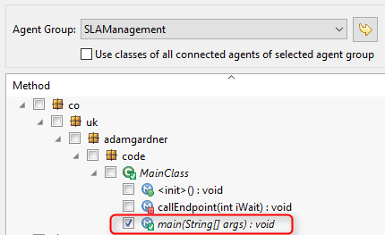
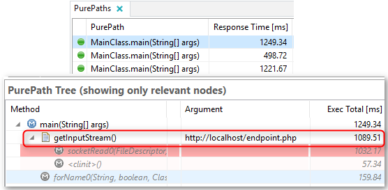
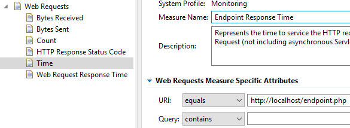
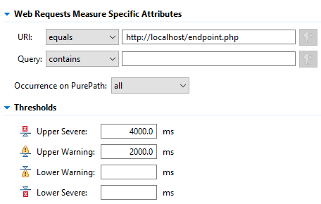
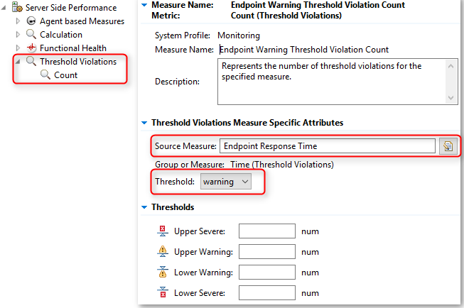

--8<-- "docs/snippets/warning-legacy-dynatrace.md"

Comprehensive SLA management and tracking is absolutely critical to the success of a project. In this post I'll investigate how Dynatrace AppMon can keep all your third parties honest.

<!-- more -->

To follow this tutorial you'll need:

- A working and licensed AppMon server and collector. (Here's a free forever license for you.)
- A PHP-enabled web server (I recommend XAMPP)
- Save the `endpoint.php` (find it [here](https://github.com/agardnerIT/XAMPP-Pages/blob/master/endpoint.php)) code into the htdocs folder of your XAMPP server.
Download the `DTSLAManagement.jar` file (from [here](https://github.com/agardnerIT/DTSLAManagement/releases/download/v1.0/DTSLAManagement.jar))

## Scenario

Our organisation uses third party API endpoints (who doesn't?). These endpoints could be internally developed services or provided entirely by a third party – we want to ensure they're performing to advertised or agreed standards – our application depends on it.

An acceptable level of performance for this endpoint is **2 seconds**. Any requests over this threshold count against the third party provider and financial penalties are incurred. Any requests above **4 seconds** automatically trigger an investigation from their support department and a heavier penalty is incurred.

## Business Outcomes

As a business owner, I want the following:

- How many calls have I had over 2 seconds.
- How many calls have I had over 4 seconds.
- An automated way of alerting their support department for >4s calls.
- A weekly report of the above.

## Test Setup

1. Place the `endpoint.php` file into the `htdocs` folder of XAMPP and start XAMPP.
2. Create a new Java based agent tier in AppMon.
3. Create a sensor group and attach it to the Java tier you've just created. Set this sensor group to Active & Start Purepaths.
4. Instrument and run the `DTSLAManagement.jar` file.


```
java -jar -agentpath:"C:/Program Files/Dynatrace/Dynatrace 7.0/agent/lib64/dtagent.dll"=name=YOUR-AGENT-NAME,server=localhost:9998 DTSLAManagement.jar
```


It should execute and look something like this:


> If you see `Connection refused: connect`, make sure you've started XAMPP!

Using the JAR is easy, just pass the number of seconds you want the endpoint to wait, as the only parameter to the JAR file.

### Wait 1 Second

```
java -jar -agentpath:"C:/Program Files/Dynatrace/Dynatrace 7.0/agent/lib64/dtagent.dll"=name=YOUR-AGENT-NAME,server=localhost:9998 DTSLAManagement.jar 1
```

### Wait 4 Seconds


```
java -jar -agentpath:"C:/Program Files/Dynatrace/Dynatrace 7.0/agent/lib64/dtagent.dll"=name=YOUR-AGENT-NAME,server=localhost:9998 DTSLAManagement.jar 4
```


## Create Purepaths

Add a sensor to the `main` method of the JAR file. You'll find it in the `co.uk.adamgardner.code` package.



## See The Purepaths

If you open the Purepaths dashlet, you should now be seeing a single Purepath created each time you run of the JAR file.

I've ran the JAR file 3 times and crucially, I can see the main method and the call out to `http://localhost/endpoint.php`



## Track It

Tracking these calls is now easy. Right click the node in the Purepath tree with the call out to the `endpoint.php` > Create Measure > Time Measure (remove the query parameter and give it a good name).



Now let's finalise the setup. Edit the system profile and go to the *Measures* section. Edit your measure and set your **Upper Warning** threshold to **2 seconds** and your **Upper Severe** threshold to **4 seconds**.




Create two new threshold violation measures. Both should have the source measure set to the your endpoint measure. One should have the threshold set to warning and the other should have the threshold set to severe.



## Visualisation

Let's put it all together on a dashboard. You can see that I've had one warning alert and two severe alerts.


Save this dashboard to the server and create an automated report and start accurately tracking your third party calls.