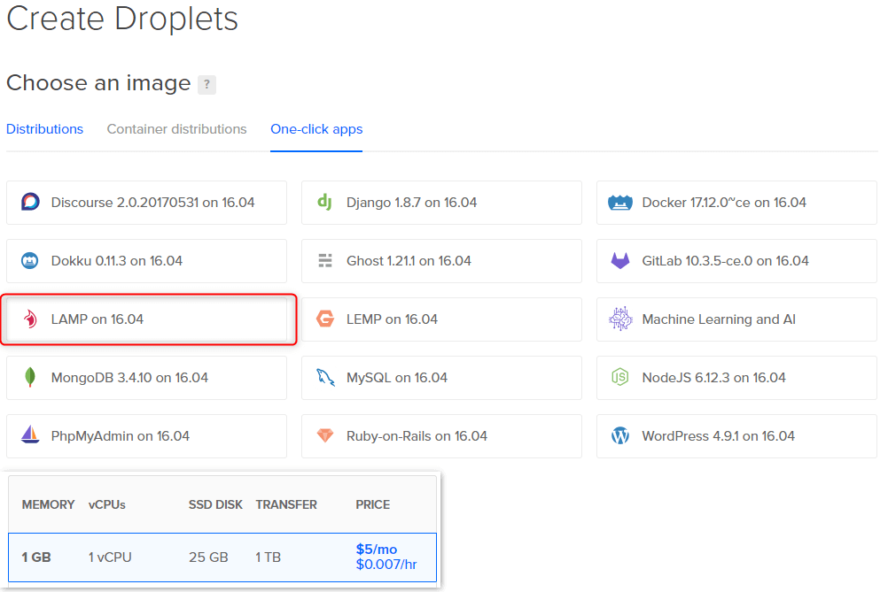
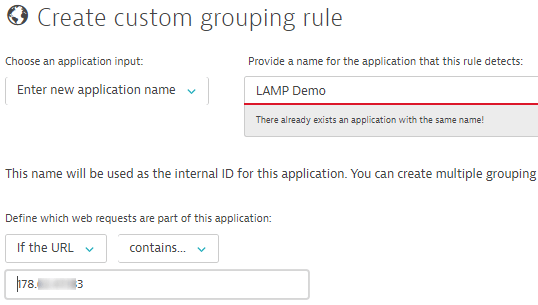
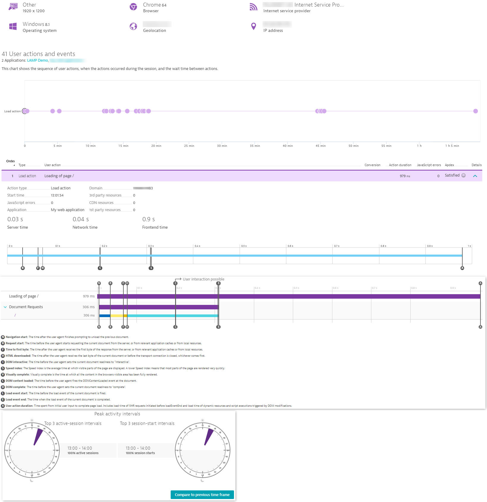
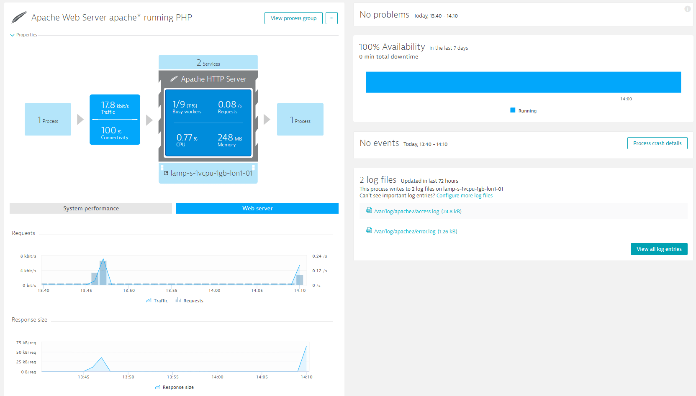
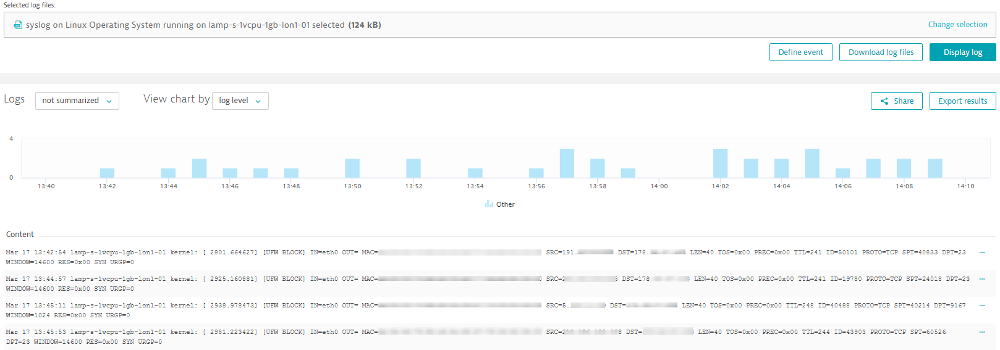

---

title: Monitor a DigitalOcean LAMP Stack in Minutes with Dynatrace
header_image: /images/headerimages/digitalocean-lamp-stack-header.png
categories:
- ai
- digitalocean
- dynatrace
- oneagent
date:
  created: 2018-03-17
---

A Linux, Apache, MySQL and PHP (LAMP) Stack is possibly one of the most widely used software stacks on the planet. Spin it up with DigitalOcean. Monitor it with automatically with Dynatrace OneAgent...

<!-- more -->

## Goal of This Tutorial

Spin up a fully functional, fully monitored LAMP stack on DigitalOcean using Dynatrace OneAgent to monitor every log file, user, host metric and every transaction.

All of these metrics will be automatically correlated and problems will be automatically generated for root causes, not just symptoms.

## Prerequisites

- A DigitalOcean account (obviously) (Run LAMP free for 2 months with [this link](https://m.do.co/c/fdf58b08514e)).
- A Dynatrace account. Sign up for a [free 15 day trial here](https://dynatrace.com/trial).
- 5 minutes to spare.

## Step 1 - Droplet Creation

1. Spin up a DigitalOcean LAMP stack using their One-Click installer. The smallest 1GB droplet will suffice for this demo.



2. SSH into your droplet, this will activate the installation.

3. Remove the default `index.html` (`sudo rm /var/www/html/index.html`) and replace with something better :)

```bash
sudo touch /var/www/html/index.html
echo '<!DOCTYPE html>
<html>
<head>
<title>DO LAMP Demo by Adam Gardner</title>
</head>
<body>
<h1>DigitalOcean LAMP Stack with Dynatrace OneAgent</h1>
<p>This is a simple test page</p>
</body>
</html>' | sudo tee /var/www/html/index.html
```

## Step 2 - Dynatrace Setup

1. Login to your tenant. Go to Settings > Web and mobile monitoring > Application rules. Click Create custom grouping rule.

2. Give your application a name and set the rule to be any URL which contains your server IP.



3. Go to Start Deploy Dynatrace and navigate to the Linux installer. Run the first and third command (second is optional) on your box. Run the `.sh` file as `root` or with `sudo`.


4. Restart apache: `sudo service apache2 restart`

## You're Done. A Fully Monitored LAMP Stack

You now have:
- A fully monitored LAMP stack.
- Automated availability tracking / alerting.
- Full visibility of every user action, click and page visit.
- Access to all log files.
- Code level tracing of Apache and PHP. Including the performance of Apache modules.







