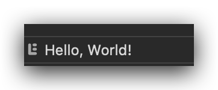
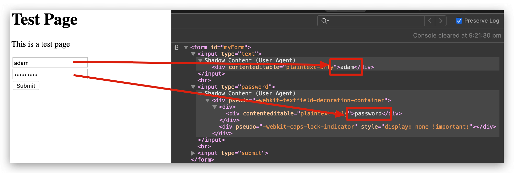

The latest feature, a new shiny library, it's all just one new JavaScript include away. What could possibly go wrong? For starters, how about having your credit card details stolen?

<!-- more -->

# Intro

I recently listened to an episode of the [Darknet Diaries podcast](https://darknetdiaries.com) where they detailed a real-world credit card skimming ring. The episode discusses how a compromised third party JavaScript tag led to millions of leaked card numbers. It got me wondering just how realistic, easy or difficult, that would be.

I am not a security professional or hacker - ethical or otherwise. My security and pen-testing background is precisely zero. Unfortunately, it turns out that's how much experience you need to make this a reality... Zero... It is that easy.

Before you think I'm just being alarmist, check out this post from Hackernoon which describes a [**far more elaborate setup**](https://medium.com/hackernoon/im-harvesting-credit-card-numbers-and-passwords-from-your-site-here-s-how-9a8cb347c5b5) using npm modules.

The message here should be loud and clear. Don't be scared, but do conduct regular reviews of **every** dependency and every piece of code, whether or not you wrote it. Ask whether you really understand what each third party library is doing, whether you need it and quantify the value that it provides, weighed against the potential risk. Get business stakeholders onboard too as they need to understand and care about this because ultimately, should something go wrong, it won't be a technical problem. It'll be a board-level business problem.

Don't believe me? Here's how easy it is.

## Step 1: Create Basic Infrastructure
VM one will act as our main website. VM two will act as our third party website (or CDN) from which we'll load the JavaScript file.

Install `apache` on both VMs. On VM one, create an index page which contains a form (imagine this is your payment page).

```html
<!DOCTYPE html>
<html>
<head></head>
<body>
<h1>Test Page</h1>
<p>Just a basic test page</p>
<form id="myForm">
<input type="text" /><br />
<input type="password" /><br />
<input type="submit">
</form>
</body>
</html>
```

On VM 2, create a new JavaScript file in the apache root directory. I've called mine `test.js`. Imagine this JavaScript is your shiny new feature or library. For now, it's perfectly valid and clean. Nothing nefarious going on here. The code simply waits for the page to load, then prints a message to the console.

```js
document.addEventListener("DOMContentLoaded", function(){
  console.log('Hello, World!');
});
```

## Step 2: Include JavaScript on page

Include the JavaScript into the HTML page on VM one. To do this, modify the `head` section of the `index.html` page on VM one and include the new script tag:

```html
<head>
  <script src="http://IP-ADDRESS-OF-VM2/test.js"></script>
</head>
```

Save the `index.html` file, open the DevTools console and refresh the page (hint: choose the option to preserve log lines). You should see the `Hello, World!` message printed in the console.

## Step 3: The Hack

Imagine it's some time later and you are running in production quite happily, everything is fine, payments are being taken successfully and securely and everything is right with the world.

However, unknown to you, the CDN or website hosting that third party JavaScript code has just been compromised. A bad actor has gained access to their servers and has modified the Javascript code.

**Your** site still runs just fine, it does what you told it to do - include the JavaScript file from the third party website.

Unknown to you though, the JavaScript on the third party site (eg. VM2) now looks like this:

```js
document.addEventListener("DOMContentLoaded", function(){
  console.log('Hello, World!');

  document.getElementById("myForm").addEventListener("submit", function(evt){
    evt.preventDefault();
  });
```

Refresh the webpage on VM1 and try to submit your payment form... That third party code has just broken your payment system but this is all you see from your browser.



That `evt.preventDefault();` line is all it took to break your entire payment system.

## Step 4: The Hack Part 2

The hackers grow bolder and decide to actually scrape your username, password, credit card details and any other details on your form. They modify the JS code to read:

```js
document.addEventListener("DOMContentLoaded", function(){
  console.log('Hello, World!');

  document.getElementById("myForm").addEventListener("submit", function(evt){
    evt.preventDefault();
    form = document.getElementById("myForm");
    console.log(form);
  });
```

Again, refresh the page and try to submit your form. What do you see now in the console? Your username and password in plain text for all to see.



Scary? Indeed! Hackers have potentially exposed payment details on your website, all without touching your actual website!

### Aside

Yes, I know that in the format suggested above, there isn't much danger as the hacker would have to be looking over your shoulder to see the console. However, it only takes a few additional lines of code to get those details off the site on to a third party system. Perhaps an additional 3-4 lines of code...

## Summary

As I said at the beginning of this post, I am not trying to scare anyone or vilify JavaScript. I am trying to point out that **you** are ultimately responsible for every line of code that runs on your website - whether you wrote them or not. The third party libraries you use demand the same level of security and scrutiny as the code you write.

If in doubt, leave it out. If you don't need that include, don't use it!

