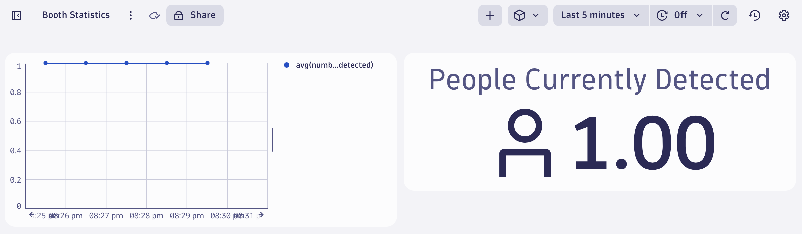
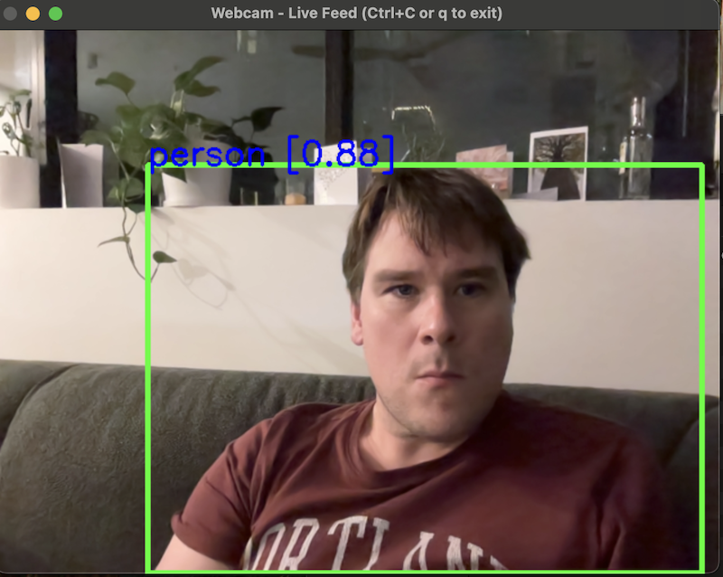

In this post I describe a realtime human tracking application, written in Python which also makes statistics available via Prometheus metrics.




```
# HELP number_of_people_detected Current count of people detected
# TYPE number_of_people_detected gauge
number_of_people_detected 1.0
```

<!-- more -->

Next week I'll be attending the AWS Summit in Sydney. The weather was also atrocious this weekend, which gave me time to pose myself a hypothetical question:

> How could we leverage AI & open source standards to track demand at the Dynatrace booth?

For this exercise I envisioned a camera on the booth facing downwards and tracking the current number of individuals at the Dynatrace booth. The task would be to track the number of people in frame - not individual people. The output of this would be somehow fed into Dynatrace and therefore we could track, in realtime, the demand at the booth throughout the day.

I am happy to say: **It works!** and here's a link to the source code: [Realtime video recognition in Python](https://github.com/agardnerIT/video-recognition-prometheus).

## Privacy Concerns

Before I dig into the technical, a quick note about the privacy concerns that could be presented with a solution like this:

1. Individual tracking of users
1. Transmission and storage of the footage
1. Tracking of other items of interest in the footage

As written, the code:

1. Does not track individual users. It tracks the number of people currently detected in the frame. That's all.
1. Any other items detected in the footage (ie. anything the model detects from the [object classes](https://github.com/agardnerIT/video-recognition-prometheus/blob/9bb63ca451a50b4b688cadc285db9c03f6864026/webcamdetect.py#L30) are simply ignored). We don't care if a fire hydrant, elephant or book is detected in the frame - the code ignores it.
1. The footage is never streamed nor stored. It is analysed in realtime and discarded. For such a system to work, there is simply no need to record or archive the footage in any way.

What results is a completely anonymous "person count" currently detected in frame - and that's all. No personally identifiable information (PII), no saved data. Nothing.


## Hardware Required

I'm happy to say there is no special hardware required. I'm running this on my laptop and leveraging the built-in camera. I've also verified it working with a USB connected camera - so your hardware should be fine.

## Software Explained

I'll be honest, I'm an AI newbie, especially with computer vision & recognition but [this post](https://dipankarmedh1.medium.com/real-time-object-detection-with-yolo-and-webcam-enhancing-your-computer-vision-skills-861b97c78993) and [this post](https://datalab.medium.com/yolov8-detection-from-webcam-step-by-step-cpu-d590a0700e36) helped tremendously - along with the great documentation from Ultralytics. Most of my code is not really mine - it's code from the above blogs. Credit where it's due!

!!! success "Start the App"
    You may need to experiment with the camera-index value until you get the correct camera. Start at `0` and work up until you hit the correct one.

    ```
    python webcamdetect.py --camera-index=0
    ```

Here's how it works:

1. The program starts
1. The program downloads the correct model (`yolov8n` by default, but this is configurable)
1. The program gets a handle to your webcam stream
1. The YOLO model is used to detect humans in each frame (there are parameters to tweak the model + certainty required to detect a human)
1. The total number of humans currently detected are written to a Prometheus Gauge metric
1. A prometheus server is started on `http://localhost:8000` (there's another parameter to alter the port)

The end result is a live feed which may look smooth or somewhat jittery depending on the value you set with the `--sleep-time-between-updates` flag.

Any humans that enter the frame will have a box placed around them - as long as the model is certain enough that they really are a human (you can tweak this confidence interval using the `--minimum-confidence-required` flag).

Point a browser at `http://localhost:8000` and wonderful, scrapable Prometheus metrics shall appear.

## Sending Data to Dynatrace

To get the data from the Prometheus endpoint into Dynatrace, use the OpenTelemetry Collector.

Start by saving a YAML file called `config.yaml`

```
receivers:
    prometheus:
      config:
        scrape_configs:
          - job_name: 'detections'
            scrape_interval: 5s
            static_configs:
              - targets: ['127.0.0.1:8000']

processors:
    resourcedetection:
      detectors: ["system"]
      system:
        hostname_sources: ["os"]
          
exporters:
  otlphttp/dynatrace:
    endpoint: https://${env:DT_ENVIRONMENT}.live.dynatrace.com/api/v2/otlp
    headers:
      Authorization: "Api-Token ${env:DT_API_TOKEN}"

service:
  pipelines:
    metrics:
      receivers: [prometheus]
      processors: [resourcedetection]
      exporters: [otlphttp/dynatrace]
```

!!! tip "scrape interval"
    Set the `scrape_interval` to be longer than the value you use for `--sleep-time-between-updates`.
    
    After all, it makes no sense to pull metrics from Prometheus more often than they're actually updated, right?

!!! info "Config YAML Explained"
    This configuration YAML tells the OTEL collector to retrieve metrics from `http://127.0.0.1:8000` every 5 seconds, enrich the metrics it finds with information pulled from the operating system (so Dynatrace users know where the metrics originated) and then to send the metrics to Dynatrace.

### Start Collector

First, go to Dynatrace, press `ctrl + k`. Search for `API tokens` and create a token with `metrics.ingest` permissions.

Also make a note of your environment ID. It is the first portion of the URL. eg. `abc12345`.

Customise the following snippet then run to start the collector and push metrics into Dynatrace.

```
// Customise these two values
export DT_ENVIRONMENT=abc12345
export DT_API_TOKEN=dt0c01.sample.secret
/path/to/collector/otelcol-contrib --config=config.yaml
```

If all goes well, you should be able to chart the `number_of_people_detected` metric.


!!! tip "Get the Code"
    Reminder: All code for this is open source here: [Realtime Video Recognition with Prometheus Statistics](https://github.com/agardnerIT/video-recognition-prometheus)