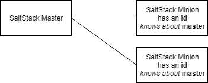

---

title: Saltstack 101 - Setup and Configuration Guide
header_image: /images/headerimages/saltstack-setup-configuration-header.png
categories:
- automation
- devops
- salt
- saltstack
date:
  created: 2018-04-03
---

[Salt / SaltStack](https://saltstack.com/salt-open-source/) is an open-source piece of software for remote administration, configuration automation and event-driven orchestration. This tutorial will show you how to get it up and running...

<!-- more -->

## Prerequisites

- A DigitalOcean account (free trial using [this link](https://m.do.co/c/fdf58b08514e)).

## Saltstack Architecture

SaltStack has a very simple architecture. One or more master nodes issue commands to one or more minion nodes.
Each minion has an id (a name) and the minion is configured to point to its master. By default, the id is the hostname of the machine, but this can be overridden.

_Note: Multiple masters and masterless configurations are supported, but this guide will not discuss these further._



## Communication Paths

Minions are configured to know about their master. Minions then reach back to their master. An administrator chooses to accept or deny that minion.

Once “accepted”, commands are issued from the master out to the minion(s).

## Setup

**General Setup**

Note: There is a bootstrap option available [here](https://repo.saltstack.com/) but in the interests of transparency, I’ll be installing it the "full" way.

- Create two Ubuntu 16.04 DigitalOcean droplets (other cloud hosts or VMs will also work). The smallest $5 droplet is sufficient for this tutorial.
- Give each machine a different hostname. I’ll call mine `saltstack-master` and `saltstack-minion`


**Master Setup**

SSH into `saltstack-master` and run the following commands. The first three lines just get things setup and add the saltstack repository to your system.
The fourth line updates your packages and pulls down the latest package list.
The fifth line does the magic, installing the `salt-master` with the `-y` parameter to skip all manual inputs and assume yes to all questions.

```bash
wget -O - https://repo.saltstack.com/apt/ubuntu/16.04/amd64/latest/SALTSTACK-GPG-KEY.pub | apt-key add -
touch /etc/apt/sources.list.d/saltstack.list
echo 'deb http://repo.saltstack.com/apt/ubuntu/16.04/amd64/latest xenial main'| tee -a /etc/apt/sources.list.d/saltstack.list
apt-get update
apt-get install salt-master -y    
```

**Minion Setup**

SSH into `saltstack-minion` and run the following commands. Notice they’re very similar to the master.
The only difference is that we install `salt-minion` and not `salt-master`.

```bash
wget -O - https://repo.saltstack.com/apt/ubuntu/16.04/amd64/latest/SALTSTACK-GPG-KEY.pub | apt-key add -
touch /etc/apt/sources.list.d/saltstack.list
echo 'deb http://repo.saltstack.com/apt/ubuntu/16.04/amd64/latest xenial main'| tee -a /etc/apt/sources.list.d/saltstack.list
apt-get update
apt-get install salt-minion -y
```

## Point Minion at Master

Remember at the beginning of the article I said that the `minion` knows about the `master`? How? We need to specify the master’s IP address on the minion.

On the minion:

```
nano /etc/salt/minion
```

Look for the line which reads `#master:salt`. Below this line, add a new line. Replace `10.0.0.0` with the IP address of your master. Save and exit the file.

Now run your salt minion simply by typing `salt-minion` on the minion.

## Accept Minion on Master

Flip back to the master node and run `salt-key -L`. This will list the status of all keys on the master.
You should see something like this:

```bash
root@saltstack-master:~# salt-key -L
Accepted Keys:
Denied Keys:
Unaccepted Keys:
  saltstack-minion
Rejected Keys:
```

This proves the minion has been able to attempt a connection to the master. Tell the master to accept connections from the minion:

```bash
salt-key -a saltstack-minion -y
```

_Note: You can also accept all minions with `salt-key -A -y`_

## You're Installed. Test It Out.

Now let’s verify that the master can find the minion. We’ll use a basic ping from the `test` module.
From master: `salt 'saltstack-minion' test.ping` and you’ll see:

```bash
root@saltstack-master:~# salt 'saltstack-minion' test.ping
saltstack-minion:
  True
```

## Bonus: Create & Write a File

If you’ve got this far, then you have a working SaltStack and the world is your proverbial Oyster.
One more demo while you’re here. Let’s create and write a line of text from the master to the minion:

```bash
salt 'saltstack-minion' file.touch "/tmp/myText.txt"
salt 'saltstack-minion' file.append /tmp/myText.txt "This is my content..."
```


