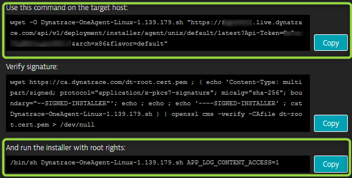
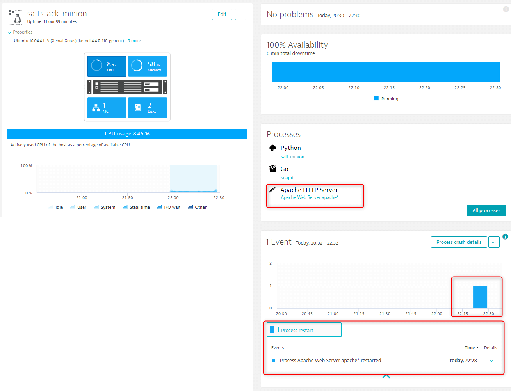
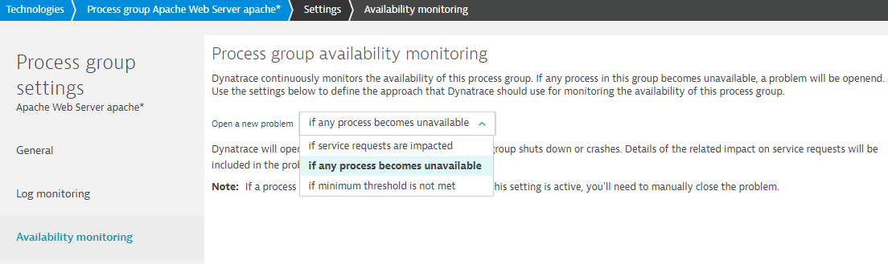
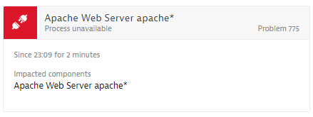
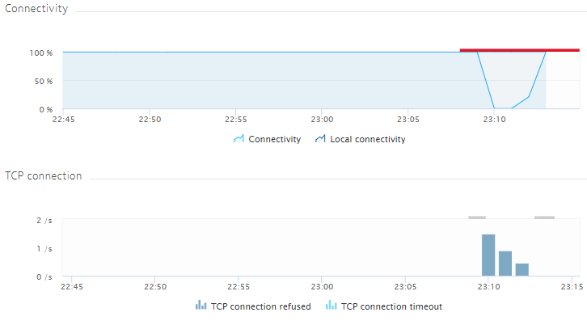

---

title: Saltstack 101 - Dynatrace Integration
header_image: /images/headerimages/saltstack-dynatrace-header.png
categories:
- automation
- devops
- salt
- saltstack
- tutorial
date:
  created: 2018-04-06
---

Auto-heal your infrastructure when problems occur with Dynatrace & SaltStack...

- [Part 1](saltstack-101-setup-configuration.md) of this 3 part series showed how to setup and configure SaltStack
- [Part 2](saltstack-101-webhooks.md) of this series showed how to use setup HTTPS endpoints with CherryPy in SaltStack

<!-- more -->

This, the final part of the series will show you how to effortlessly monitor and create an auto-healing service with a combination of Dynatrace and SaltStack.

## Prerequisites

- A Dynatrace account. Sign up for a [free 15 day trial here](https://dynatrace.com/trial).

All of the following prerequisites will be met if you’ve followed parts 1 and 2 of this series.

- Running master and minion SaltStack instances.
- CherryPy running and configured on the master
- An apache2 server running on the minion.

## Scenario

Imagine that the `apache2` process running on the `minion` is your critical infrastructure. Not only do you need to monitor this, but you want to ensure it auto-heals in case of any issues.

## Installing Dynatrace OneAgent

Install your Dynatrace OneAgent by grabbing the install commands from your tenant: `https://YOUR-TENANT-ID.live.dynatrace.com/#install/agentlinux`



Execute these commands on your minion…

For example:

```bash
wget -O Dynatrace-OneAgent-Linux-1.141.124.sh "https://YOUR-TENANT-ID.live.dynatrace.com/api/v1/deployment/installer/agent/unix/default/latest?Api-Token=***&arch=x86&flavor=default"
sudo /bin/sh Dynatrace-OneAgent-Linux-1.141.124.sh APP_LOG_CONTENT_ACCESS=1
```

Navigate to the hosts screen in Dynatrace and after a few moments you will see your `saltstack-minion`. Drill into it and notice that it has already automatically discovered the `apache2` process.

In order to monitor this fully, we need to restart `apache2`. Either execute `service apache2 restart`, or if you want to do it via REST call to SaltStack:

```bash
POST https://YOUR-DOMAIN-OR-SALT-MASTER-IP:8000
Headers
X-Auth-Token: YOUR-AUTH-TOKEN
Request Body
{
  "client": "local",
  "tgt": "saltstack-minion",
  "fun": "service.restart",
  "arg": "apache2"
}
```

Notice how Dynatrace has automatically detected all process stats and the process restart...



## Integrate SaltStack Via Webhook

Create a new webhook integration from within your tenant: `https://YOUR-TENANT-ID.live.dynatrace.com/#settings/integration/notification/integrationwebhook`


## Process Death Alerts vs. User Impact Alerts

This is an optional step, but it is worth pointing out.

In order to prevent “alert storms” and noise, the default behaviour of Dynatrace is to only create problems when they are genuine and impacting real users. In other words, if requests to the service are impacted (ie. if web requests to `apache2` fail). Dynatrace will raise such problems after a few moments.

For this reason, if we kill `apache2` now, Dynatrace will raise a problem with two events. The first will be that service requests are impacted and the second, the root cause is that the `apache2` process is unavailable.

This behaviour is configurable. You can choose to receive an alert when the process dies, should you wish.

To configure this, go to the Technologies link > Click Apache > Click Process Group Details > Edit > Availability Monitoring.

Now select if any process becomes unavailable from the dropdown box.




## Create Chaos

All that remains is to kill `apache2`, sit back and watch everything else auto-heal thanks to Dynatrace and SaltStack.

```
POST https://YOUR-DOMAIN-OR-SALT-MASTER-IP:8000
Headers
X-Auth-Token: YOUR-AUTH-TOKEN
Request Body
{
  "client": "local",
  "tgt": "saltstack-minion",
  "fun": "service.stop",
  "arg": "apache2"
}
```

### What Really Happens

- You kill the `apache2` process
- Dynatrace notices and raises a problem. As soon as this problem is raised, Dynatrace triggers the call to the SaltStack webhook.
- SaltStack takes remediation action. In this case, restarting `apache2`

> Notice that you can also see the impact _while_ the `apache2` process was offline. Dynatrace gives you the rate of TCP error connections too so you can see how many users were impacted during the downtime.




