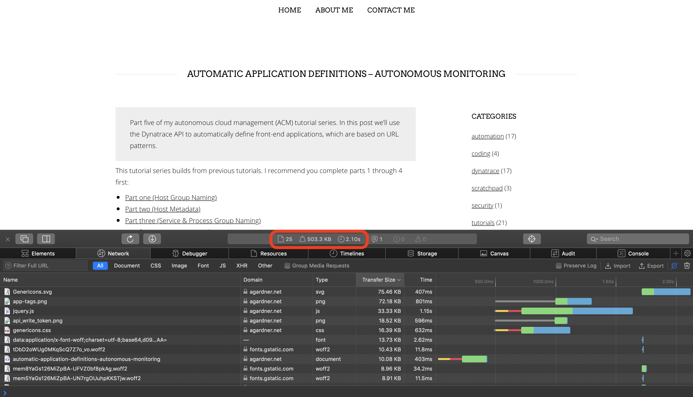

As I have [previously mentioned](why-blog-serverless.md), I recently moved this site to GitHub Pages. This post will investigate the performance impacts of that decision.

<!-- more -->

## Reliability
Reliability is defined as the "probability that a system will produce correct outputs" (source [Wikipedia](https://en.wikipedia.org/wiki/Reliability,_availability_and_serviceability)).

Think about the old site vs. the new site, the old site consisted of a webserver (Apache), PHP engine and a MySQL database. The new site consists of a markdown file (and potentially a few images), committed to a Git repository.

There are far fewer failure points (inside my control) in the new setup than in the old. In the old system, I had to ensure I kept each of the following components up to date:

- Apache webserver.
- PHP version.
- MySQL DB.
- The droplet (virtual machine).
- Wordpress installation.

All of these were potential failure points & additional overhead. There was always the chance that any of the connections *between* these components failed and affected the reliability of the site.

For example, the DB could be hacked. The webserver would still be running and *available* but the data would not be retrieved - therefore affecting the *reliability*.

In the new system, the parts inside my control are:
- My GitHub account.
- The markdown pages and images.

I've committed the markdown content to GitHub, which is of course, a version control system - so incremental backups are taken care of.

I've also saved a copy of the files to my cloud storage: My redundant backup should GitHub decide to go offline.

GitHub Pages powers [help.github.com](https://help.github.com) among many other websites. If GitHub Pages were to have a problem, you can bet that GitHub would know about it *and* care enough to fix it.

Unfortunately Pages does not publish availability figures, although I would be willing to bet that they match or exceed anything I could achieve on my own.

## Availability
Commit the markdown code to the `master` branch & let GitHub handle the rest. Sounds promising! It also sounds like whatever magic occurs in the background, it had better be reliable.

[This post](https://github.blog/2015-04-27-eight-lessons-learned-hacking-on-github-pages-for-six-months/) from 2015 suggests that GitHub Pages powered about 700,000 sites. I am going to suppose that number is significantly higher today.

If GitHub are providing a service to over 1 million sites, it is probably fair to assume they'll take their availability seriously.

As previously mentioned, the fewer components to go wrong, all else being equal, the more reliable and available the site / service will be. It does not get much simpler than a markdown file.

## Maintenance
In the old world, I had to periodically update each of the components. The webserver software, database, the Wordpress installation and the VM itself.

What do I need to maintain in the new world? Nothing. Well, I need to ensure my GitHub account doesn't get hacked. Then again, there's nothing to hack - [everything is publicly available](https://github.com/agardnerIT/site).

Don't tell me you're relying on [security through obscurity](https://en.wikipedia.org/wiki/Security_through_obscurity)...

## Response Time
Response time is a function of various factors but in simple terms:

- Page weight (the number of objects it takes to load a page & their size).
- Geolocation relative to the end user.
- Quality of the infrastructure serving the content.

### Before

Look at the "before" picture. The old site loaded **25 resources**. The page size was **0.5MB**. The old page took over **2 seconds** to load:

### After

Now the "after picture". The new site loads **12 resources**. The page size is almost **half** the previous weight at **280kb**. This means that the page loads in just **0.5 seconds**. That's a **75% percent improvement** in response time:

## Conclusion

Moving to a "serverless" model simply means delegating responsibility of infrastructure to someone else. Whether or not that fits your operating model, usecases and level of trust depends entirely on you.

The negative impacts of going serverless stem from the above - if something goes wrong with _their_ infrastructure, _you're_ affected but cannot necessarily do anything to rectify the situation. That is why great quality monitoring is essential in a serverless world.

That said, if you're running a small personal site or blog, I see few reasons _not_ to move to a serverless model.

As always, if you have any questions or comments, feel free to [contact me](../contact.md). 