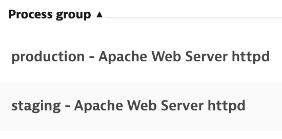
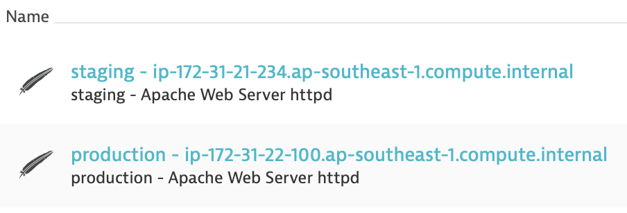
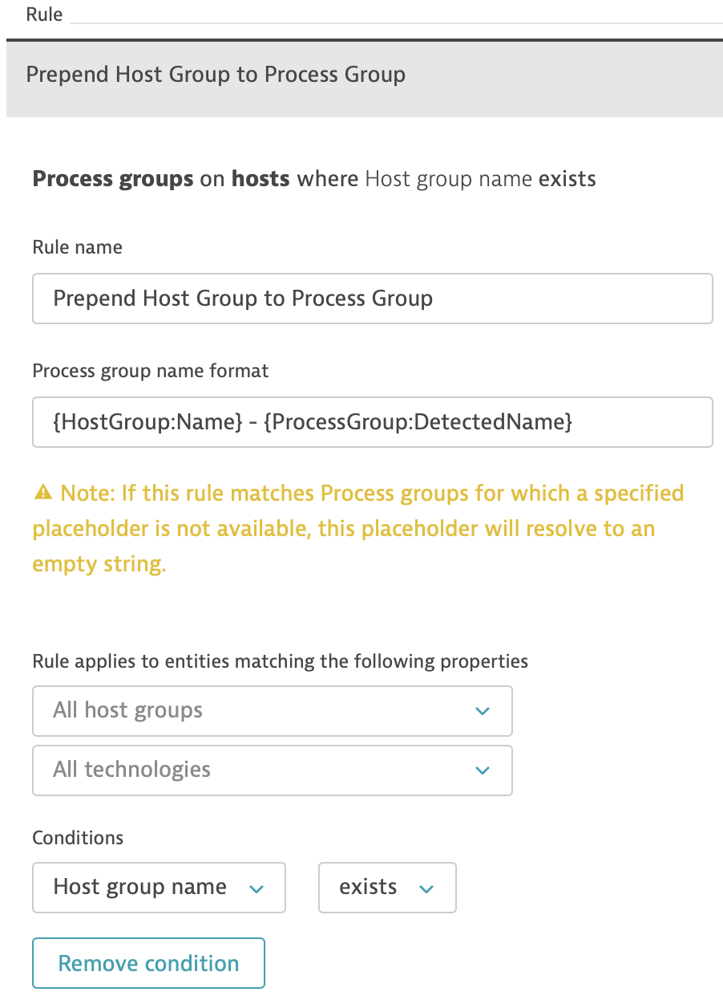
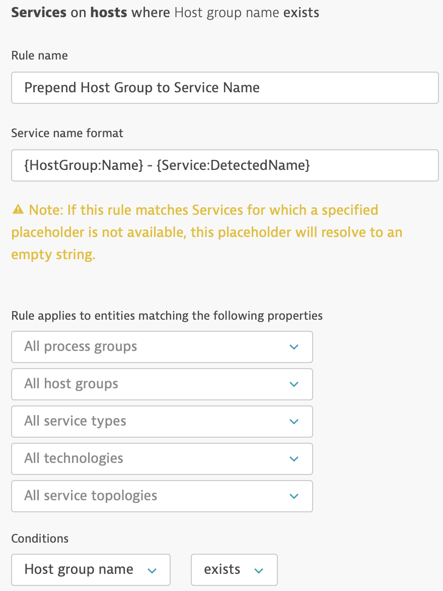
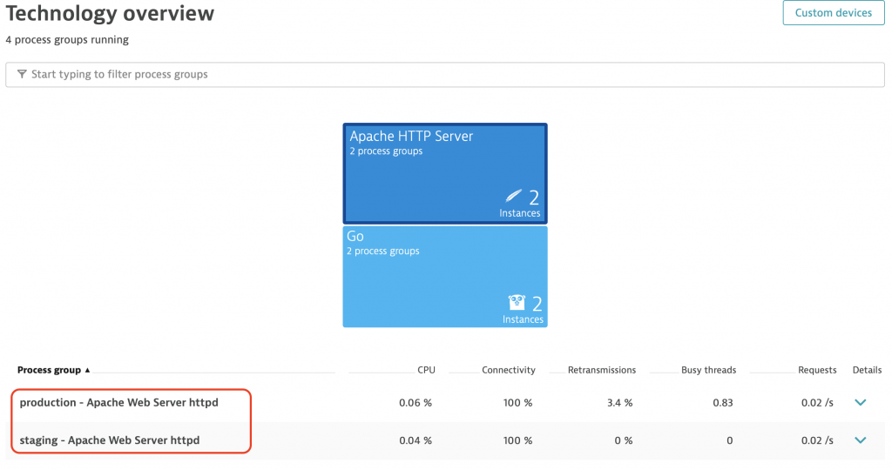
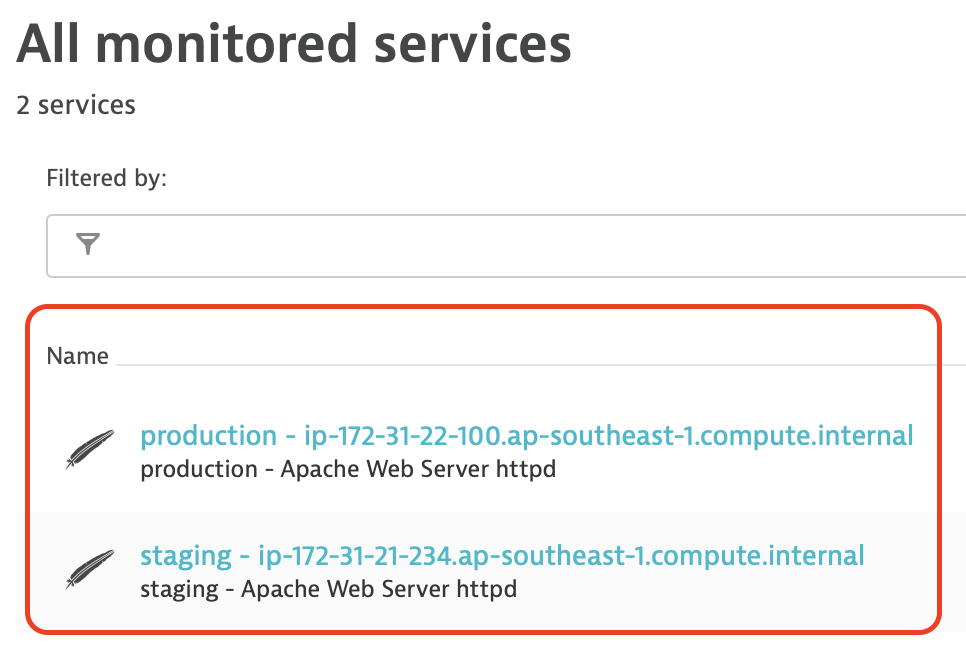

Part three of my Dynatrace autonomous cloud management (ACM) series will focus on automatic service and process group naming.

<!-- more -->

This tutorial series builds from one stage to the next. If you haven’t read [part one (host group naming)](assured-host-groups-autonomous-monitoring.md) and [part two (automated metadata)](assured-host-metadata-autonomous-monitoring.md)), I strongly suggest you start there.

## Aim of Tutorial

We’re aiming for a situation whereby the process groups (PGs) & services are prepended with the host group tag. That is, the `staging` processes are split (and visually shown) as separate from the `production` PGs and services. This makes it easy to see which service belongs to which environment.

> Note: The naming rules described in this article don’t actually split the groups. The splitting is due to the different host groups. The naming rule is just a visual aid – otherwise you’d have two Apache Web Server `httpd` process groups & services.





## How?

First, we need to install and start Apache on both instances. Add the following tasks at the end of your playbook:


```yaml
- name: Install HTTPD (Apache)
  become: yes
  package:
    name: httpd
    state: present

- name: Start HTTPD (Apache)
  become: yes
  service:
    name: httpd
    state: started
```


Execute your playbook then check in Dynatrace to see the `httpd` processes.

Open port 80 inbound to the instances and visit the public IP address for each instance in a browser. Hit refresh a few times per server to generate some load. This ensures the services show in the Dynatrace UI. 

Services without traffic are hidden in the Dynatrace UI.

As mentioned above, the Apache process groups and services are already split because the hosts belong to different host groups. We simply need to prepend the host group name to both the process group and service.

## Process Group Naming

Go to: Settings > Processes and Containers > Process group naming
Create a new rule which has the following name format:


```
{HostGroup:Name} - {ProcessGroup:DetectedName}
```


Set the Condition to be where the `Host group name exists`.

## Service Naming

Go to Settings > Server-side service monitoring > Service naming rules

Create a new rule which has the following name format:


```
{HostGroup:Name} - {Service:DetectedName}
```


Set the Condition to be where the `Host group name exists`.





## Validation

Navigate to the **Technologies** menu (under ‘Monitor’) and click the Apache tile. You should see two Apache process groups:



Navigate to the **Transactions and Services** screen (under ‘Monitor’). You should see two Apache services:



This technique is entirely future proof. Whenever a new environment is onboarded (aka a new host group), Dynatrace will automatically split and rename your process groups and services accordingly.
