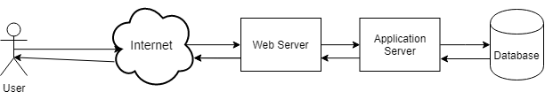

What is caching, how does it relate to (and differ from) static content and how can you use it to increase the performance of your websites?

<!-- more -->

As you’d expect, most web performance techniques are complementary to one another. Functionality and terms tend to be blended / used interchangeably a lot of the time. As one example, you can cache static content on a CDN edge server (aka edge node). This will require different technologies, technical know-how and skillsets – but they all lean towards the same goal; delivering content back to the user as quickly as possible.

Most web performance techniques and technologies are complementary… All aim to deliver content back to the user as quickly as possible.

Caching takes many forms (caching to disk, browser caching, in memory caching, GPU caching etc.) This article will focus on a specific usecase: caching dynamic content for performance.

## The "Problem" With Dynamic Content

Why are we looking to cache dynamic content at all? As above, it’s all about the performance your end user experiences.

Imagine the user requests some content. Instinctively, which of these do you think will perform better:

If the request has to be passed (and processed) all the way through your infrastructure to the database and back again – it’s likely to be much slower than simply serving a copy of the data from the first “hop” in the chain.

## Caching Dynamic Content

Imagine you have a service which is dynamic in nature. That is, you’re pulling data from a source which is likely to change _regularly_ for _most users_. Some examples:

- A list of users
- A product list
- A "top 10" list
- A list of news articles

Notice I’ve emphasised regularly and most users. This is deliberate and it all depends on your definition of those terms.

If your product list changes once a week, you could consider your product list as static content thereby serving the same static list for a week, changing it once per week. This would reduce the load on your database / backend systems and thus ultimately, save money.

Your product list changes once per week. Cache it, serve it as static content and save load (and money) on infrastructure costs.

## Search Results - Truly Dynamic?

Imagine you are responsible for a search engine. A company internal engine or a worldwide engine such as Google. It doesn’t matter.

> Is Google truly dynamic? Would you want it to be?

- How dynamic do you want your search engine to be?
- Imagine a user repeatedly searches for "hammer". Would they really want a different top result every time or would they want some consistency between searches?
- How "fresh" should the search results be?
- Do you cache results per user or across the userbase?
- As soon as one user searches for "hammer", does this user see the same top results repeatedly or do all users see this set of results?

## Caching Third Party Calls

Caching third party calls can save money, improve performance and reliability.

I recently wrote some software that took input from a user which included a UK postcode. The software performed a geo-lookup of the `latitude` and `longitude` (using a third party service) then plotted the location on map.

I therefore had two choices when designing this application:

1. Store the postcode in the database. Perform the geo-lookup for all postcodes every time the user viewed the map.
2. Do the geo-lookup once and store the latitude and longitude in the database. Thus to render the "map view", the software doesn’t need the third party again.

I decided on option 2 for three reasons:

- Geographic locations of postcodes are unlikely to change often. To all intents and purposes, they’re static.
- Each geo-lookup costs money. Fewer calls to the 3rd Party = Less money spent.
- Each geo-lookup makes us reliant on a third party. Fewer calls = Less reliance on sites we don’t control.

Eagle eyed viewers will recognise that we could take this a step further: Since the `lat / long` data is static, we could simply store this as a static file and thus avoid the database call.

## The Downside of Caching

As we’ve seen, caching is basically saving a static copy of some data and returning that copy to the user, rather than the "real" (underlying) data.

One big issue with caching is when the cached copy becomes "out of date".

## Scenario - Ecommerce Prices

A company releases new products and prices once per week. They’ve decided to cache their product pages each week. This is working perfectly... Until a staff member realises they’ve misplaced a decimal point so their product is $10.00 and not the $100.00 it should cost.

Does the company simply wait a week and live with the lost revenue?

## Scenarios - Misworded Blog

A blog has decided to cache their posts. Unfortunately, an author has misspelled a word and thus introduced a swear word into a blog post. The blog post cache updates once a month. You can see the potential for embarrassment here...

## Conclusion

As with most things in life, there is no singular answer on how / when or why to use caching. It all depends on your application, use-case and (in a lot of cases) organisational policies.

Notice that I also haven’t discussed the technical mechanisms (or how we cache the data) at all in this post. Again, it depends on your specific use-case.

> There’s always a different way to do things. Is it worth it? Will the benefits to my users outweigh the cost and effort of making the change?

As with all web performance topics, there’s almost always a different way to do things. The question is: Is it worth it? Will it really bring benefits to my users and do those benefits outweigh the effort of making the change in the first place.