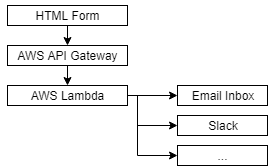

A post describing the architectural changes I had to make when moving from a Wordpress hosted blog to a Github Pages, serverless model.

<!-- more -->

## The Old

At a very high level, this is what my website used to look like. I had a Wordpress instance, running everything on a single VM. Whenever someone submitted the contact form, Wordpress would send me an email.

Unboxing "Wordpress" gives us this view. An apache webserver in front of PHP. PHP being responsible for the server-side processing and ultimately, sending the email outbound.

There is also a MySQL database on the box, which stores all the Wordpress content (blog posts) and settings.

## Distributed, Highly Available Wordpress

There are, of course, solutions for configuring Wordpress in a distributed and highly available manner. A quick search will give you many, many options. However, [as already mentioned](why-blog-serverless.md), I wanted to simplify the deployment model and wherever possible, remove any self hosted components.

## The New

In terms of what I know and control, the site architecture (particularly the contact form) now looks like this.

I commit code to GitHub. They generate the content (HTML pages). The contact form `POSTs` the data to AWS Lambda, via the AWS API Gateway. Lambda then processes the form and sends the notifications to one or more "targets".

These "notification targets" can be anything at all really: log files, email, Slack, MS Teams, Trello, the list is endless...

If you want to try out the contact form, it is [here](../contact.md).

## Advantages of the New Approach

Obviously I don't host any of this. GitHub handles the front end and AWS handles the Gateway and Lambda code.

Another big advantage is that hosting is free. AWS Lambda provide 1 million requests and 400,000 GB seconds of compute time **per month**. Given that a contact form submission takes around 1 second, I'd need to exceed 400k contact form request per month to start getting charged. I am nowhere near that!

## Summary

There was a learning curve to understand how the API Gateway and Lambda fit together (basically, AWS API Gateway is the required "front door" for any Lambda functions).

There was also a learning curve to write the tiny piece of Python code that powers my Lambda function.

That said, I am really happy with the move to a serverless model. Everything is offloaded and I am not responsible for any of the hosting, backups, redundancy, scaling - all topics I have covered in my other post.

As per my other post, I am not advocating this for every site and situation, but it should definitely be on your shortlist to at least investigate.
