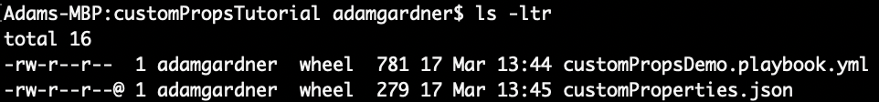

---

title: Working With JSON in Ansible
categories:
- ansible
- json
date:
  created: 2019-03-17
---

Reading JSON in Ansible is easy. Here are some examples...

<!-- more -->

This is a JSON array of objects (hosts). Each host has a nested object called customProperties. Assume this is stored in a file called customProperties.json in the same directory as your playbook.



```json
[{
  "hostname": "host1",
  "customProperties": {
    "foo": "first",
    "foo2": "second"
  }
}, {
   "hostname": "host2",
   "customProperties": {
     "foo": "third",
     "foo2": "fourth"
  }
}]
```

## Read JSON Into Ansible

Let’s read this file into Ansible. Once done, it will be available as an Ansible variable called hostList (or whatever you define on line 6 of the playbook).


```yaml
---
- name: Write vars
  hosts: local

  vars:
    hostList: "{{ lookup('file', 'customProperties.json') }}"
```


## Output Raw JSON

Now extend the playbook to output the RAW JSON object. For this we’ll use the debug module to print out to the screen.


```yaml
---
- name: Write vars
  hosts: local

  vars:
    hostList: "{{ lookup('file', 'customProperties.json') }}"

  tasks:

  - name: "Output all hostList as-is"
    debug:
      msg: "{{ hostList }}"
```


## Print All Host Names

Using the Ansible `loops` keyword, we can iterate through each top level object (host) and print out any property, one at a time.

Let’s extend the playbook to loop through and print each `hostname` value.

Notice the use of the `item` keyword. This is a special Ansible keyword which refers to the current item in the loop.


```yaml
---
- name: Write vars
  hosts: local

  vars:
    hostList: "{{ lookup('file', 'customProperties.json') }}"

  tasks:

  - name: "Output all hostList as-is"
    debug:
      msg: "{{ hostList }}"

  - name: "Print all hostnames"
    debug:
      msg: "{{ item.hostname }}"
    loop: "{{ hostList }}"
```


## Print Nested Value

Now for something more complex. Let’s track down deeper into the JSON object to print the value of `foo2` for each host.


```yaml
---
- name: Write vars
  hosts: local

  vars:
    hostList: "{{ lookup('file', 'customProperties.json') }}"

  tasks:

  - name: "Output all hostList as-is"
    debug:
      msg: "{{ hostList }}"

  - name: "Print all hostnames"
    debug:
      msg: "{{ item.hostname }}"
    loop: "{{ hostList }}"

  - name: "Print 'foo2' for each host. Should be 'second' and 'fourth'."
    debug:
      msg: "{{ item.customProperties.foo2 }}"
    loop: "{{ hostList }}"
```


## Print Nested Value When Condition Is Met

Finally, let’s choose to only print the `foo` value when the hostname is `host2`.


```yaml
---
- name: Write vars
  hosts: local

  vars:
    hostList: "{{ lookup('file', 'customProperties.json') }}"

  tasks:

  - name: "Output all customProperties as-is"
    debug:
      msg: "{{ hostList }}"

  - name: "Print all hostnames"
    debug:
      msg: "{{ item.hostname }}"
    loop: "{{ hostList }}"
    
  - name: "Print 'foo2' for each host. Should be 'second' and 'fourth'."
    debug:
      msg: "{{ item.customProperties.foo2 }}"
    loop: "{{ hostList }}"

  - name: "Print 'foo' for host2. Should be 'third'."
    debug:
      msg: "{{ item.customProperties.foo }}"
    loop: "{{ hostList }}"
    when: "item.hostname == 'host2'"
```


The latest version of the [playbook](https://github.com/agardnerIT/OddFiles/blob/master/customPropsDemo.playbook.yml) and [JSON](https://github.com/agardnerIT/OddFiles/blob/master/customProperties.json) will always be available on Github.